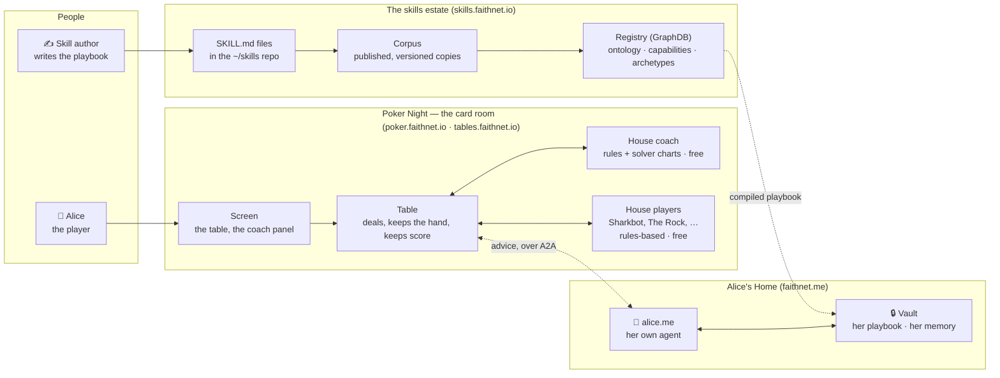
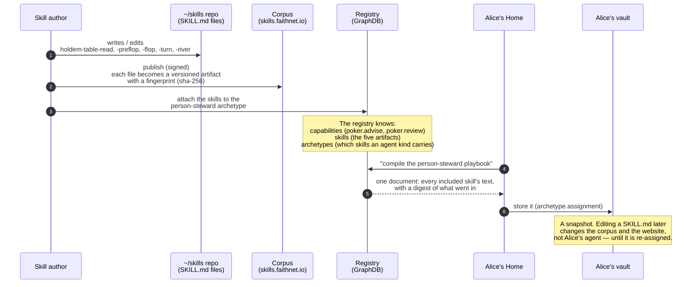
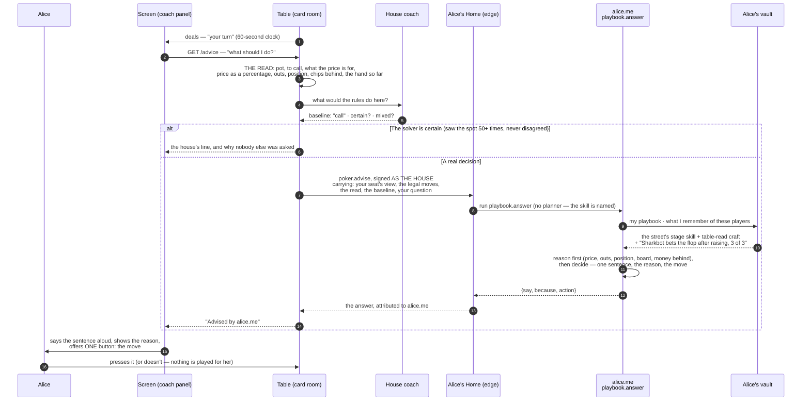
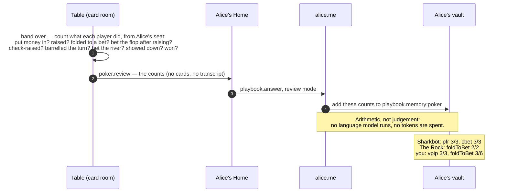
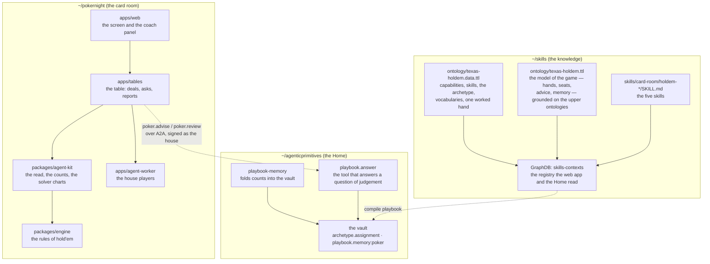

# How your own agent advises you at a hold'em table

*The whole journey, from a text file somebody wrote to a sentence on your screen — for anyone, technical or not.*

Status: as-built, 2026-09-12. The engineer's map of the same ground is `docs/HOLDEM-COACH.md`; the rules the code is held to are in `CLAUDE.md`. This document is the story with pictures.

---

## 0. The one-paragraph version

You sit at a hold'em table on **poker.faithnet.io**. When it is your turn, the card room works out the facts of your spot (the pot, what a call costs, your outs, your position), asks your own agent — the one that lives at your Home, **alice.me** — what you should do, and shows you the answer: one sentence, the reason, and a button for the move. Your agent answers from a **playbook** it carries: a handful of skill documents somebody wrote in plain English (how to read a hand, how to play the flop, the turn, the river), compiled into it once and kept in its own vault. After each hand the card room sends your agent what everybody did, as counts, so next hand it also remembers *"Sharkbot bets every flop he raises."* Nothing the agent says is ever played for you; you press the button or you don't.

---

## 1. The cast

**In plain words.** There are three worlds. The **card room** deals the cards and runs the table. The **skills estate** is where the knowledge lives: text files an author writes, published as versioned artifacts, catalogued in a registry. **Alice's Home** is where her agent lives with its own private vault. The card room never holds Alice's playbook or memory — it *asks* her agent, and shows whose answer it is.

Three things can advise at a table, and Alice chooses which:

| Adviser | What it is | Costs |
|---|---|---|
| **House coach** (default) | A rules engine inside the card room, backed by solver charts | nothing |
| **A house player** (Sharkbot, The Rock, Deep Thought…) | The same rules engine, biased into a style | nothing |
| **Her own agent** (alice.me) | A language model at her Home, reasoning from her playbook and memory | her tokens — the panel says so before she picks it |

The house never spends tokens. The only language model in the room is a person's own, when they name it.

---

## 2. From a text file to your agent's playbook

*How a skill written by a person becomes something Alice's agent plays by.*

**In plain words.** A skill is a short essay in a `SKILL.md` file — *"the price of a call is toCall ÷ (pot + toCall)… never fold when checking is free…"*. Publishing it makes a numbered, fingerprinted copy nobody can quietly change. The registry is the catalogue: it records that these five skills realise the **capabilities** `poker.advise` and `poker.review`, and that the **person-steward** archetype (the blueprint every person's own agent is built from) includes them. When Alice's Home *assigns* that archetype to her agent, the registry compiles all the included skills into one playbook and the Home stores it in her vault. From then on her agent plays by that copy.

Why a copy and not a live link? So that what her agent answered on Tuesday can be explained on Wednesday: the playbook is versioned and fingerprinted, like a signed contract. The cost is that a newly published skill only reaches her after re-assignment.

**The three words, defined once.**

- **Capability** — a thing an agent can do, by name: `poker.advise` (say what to do from a seat), `poker.review` (remember a finished hand), `poker.act` (take a turn — only the house players carry this; a coach is not a player).
- **Skill** — a `SKILL.md` document: the *how*. Five of them for hold'em: the shared craft of reading a hand, then one per street.
- **Archetype** — a blueprint for a kind of agent: which capabilities it has and which skills it carries. Alice's agent is a *person steward*; the hold'em skills are part of that one blueprint rather than a separate "poker agent", because a person holds one blueprint and swapping it would lose her payments and invitations for the length of a card game.

---

## 3. One hand: from the deal to the advice on your screen

**In plain words.** When it's your turn, the screen asks the card room for advice. The card room does the arithmetic first — the model is never asked to compute a percentage, because it gets those wrong; it is *handed* the numbers. It also asks its own rules coach for a baseline. If the solver charts have seen this exact spot dozens of times and always agreed (a clear fold, a clear raise), the house answers and your agent's tokens are saved. Otherwise the card room signs the question **as the house** (so your agent knows who's asking) and sends it to your Home. There, your agent skips the usual planning step — the question names the skill — and answers straight from its playbook: the shared craft plus the one stage skill for this street, plus what it remembers about the players at this table. It writes its reasoning first, then the answer. Back at the table, the panel shows *whose* voice it is. Eight to fifteen seconds, door to door.

Two things a coach is held to, by the code and by the ontology:
- **It sees only what your seat sees.** Your two cards and the board — never anyone else's cards. Advice built on hidden cards would teach a way of playing you can never reproduce alone.
- **Advice is evidence, never authority.** The card room applies nothing it returns. You press the button.

---

## 4. After the hand: what your agent remembers

**In plain words.** The card room keeps no record of how anybody plays — it has nowhere to put one. What it does is *report* each finished hand to your agent as counts, and your agent keeps them in its own vault. Next hand, those counts come back with the rates worked out (*"folds to a bet 80% of the time, over 5"*), and the skill teaches what they mean. You can also ask your agent directly, from the panel: **"How am I playing?"** — it answers from your own line in that memory (*"you're calling every hand preflop with zero raises…"*).

This review used to cost a model call per hand and remember nothing. Now it remembers and costs nothing.

---

## 5. Where everything lives

**In plain words.** Three repositories, three jobs. **skills** holds the knowledge and the model of the game (the *texas-holdem* ontology says what a hand, a seat, a decision spot, a piece of advice and a memory *are*, in the same terms every other domain uses). **agenticprimitives** is the Home: where a person's agent runs, and where its vault is. **pokernight** is the card room: the rules of the game, the arithmetic of a read, the solver charts the house plays by, the table, the screen, and the house players.

The charts deserve one sentence: the house coach's baseline is not folklore. It's a lookup built from 560,000 solver-labelled decisions (PokerBench), scoring 91% preflop and 80% postflop against the solver's held-out set, and when the solver itself splits on a spot the baseline says so — which is exactly where your agent's memory of the player across the table earns its keep.

---

## 6. Glossary, in plain words

| Word | Meaning here |
|---|---|
| **A2A** | Agent-to-agent: the standard way one agent sends another a message and gets an answer. The card room and your Home talk this way. |
| **Home** | The place your own agent lives (faithnet.me). It holds your vault and signs things for you; the card room never holds your keys. |
| **Vault** | Your agent's private records. Your playbook and your poker memory are two of them. |
| **Archetype** | A blueprint for a kind of agent — which capabilities and skills it carries. Yours is *person steward*. |
| **Capability** | A named thing an agent can do: `poker.advise`, `poker.review`, `poker.act`. |
| **Skill / SKILL.md** | A plain-English document of *how* to do something. Five of them for hold'em. |
| **Playbook** | All of an agent's skills compiled into one document, fingerprinted, stored in its vault. |
| **The read** | The facts of your spot, computed by the card room: pot, price, outs, position, money behind, the hand so far. |
| **Baseline** | The house coach's own answer for the spot, sent along so your agent starts from something right about the mechanics. |
| **Certain** | The solver saw this exact spot many times and never disagreed — so the house answers and your agent isn't asked. |
| **Mixed** | The solver itself splits (bet 32% / check 68%) — carried as such, so your agent's memory can pick a side. |
| **Review** | The card room telling your agent how a finished hand went, as counts. |
| **Registry / GraphDB** | The catalogue of ontologies, capabilities, skills and archetypes that the website shows and the Home compiles from. |
| **Ontology** | The formal model of what things are — a hand is a *situation*, the rule book is a *description*, "button" is a *role a seat plays* — shared across every domain so they can be reasoned about together. |
| **The house** | The card room's own service identity. It deals, it asks your agent on your behalf, and it spends no tokens. |

---

## 7. Where to look in the code

| Step | Where |
|---|---|
| The skills | `~/skills/skills/card-room/holdem-*/SKILL.md` |
| The model of the game | `~/skills/ontology/texas-holdem.{ttl,clusters.ttl,data.ttl}` |
| Registering skills on the archetype | `~/skills/ontology/agentic-trust.data.ttl` (person-steward), `~/skills/scripts/publish-ontology-skills.mjs` |
| Compiling and assigning the playbook | `~/agenticprimitives/scripts/assign-person-archetype.mts` |
| The read, the counts, the charts | `packages/agent-kit/src/{explain,observe,preflop-chart,postflop-chart}.ts` |
| The table asking and reporting | `apps/tables/src/table-do.ts` (`/advice`, `askAdviser`, `reviewWithAdvisers`), `apps/tables/src/a2a.ts` |
| Signing as the house | `apps/tables/src/house-caller.ts` |
| The Home answering | `~/agenticprimitives/apps/demo-a2a/src/playbook-answer.ts`, `playbook-memory.ts` |
| The screen | `apps/web/src/components/PokerCoach.tsx`, `Coach.tsx` (the adviser picker) |
| The house players | `apps/agent-worker/src/personas.ts` |
