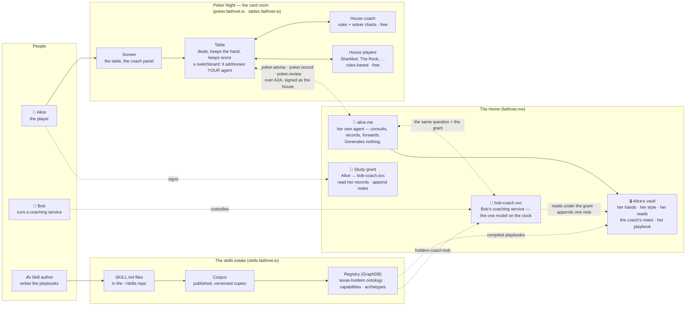
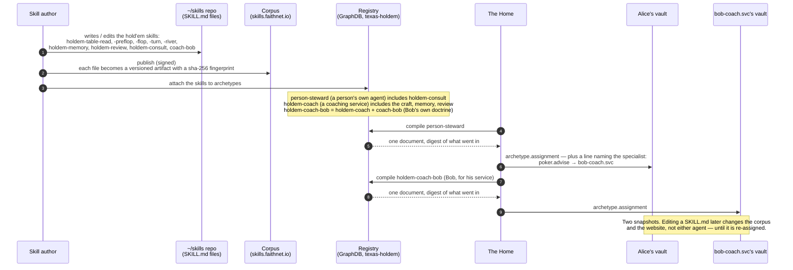
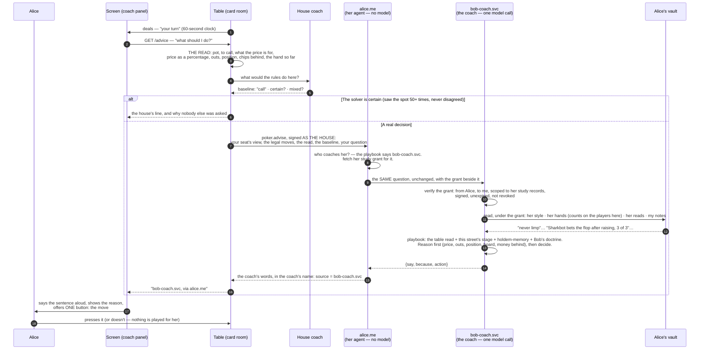
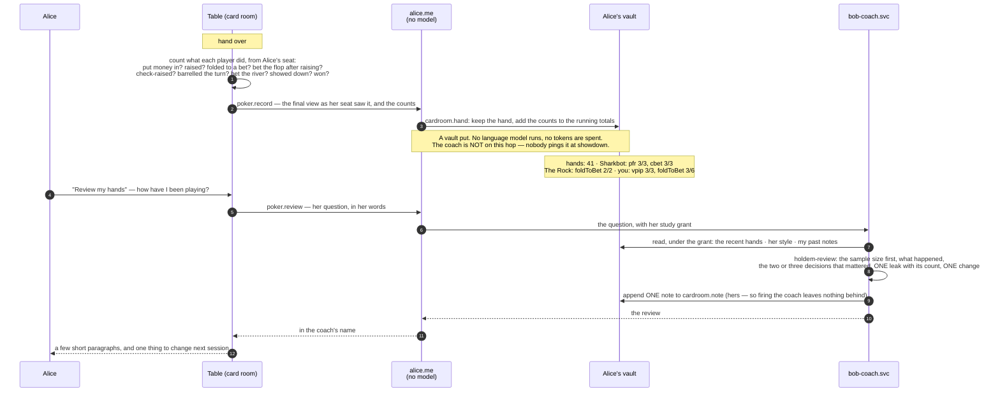
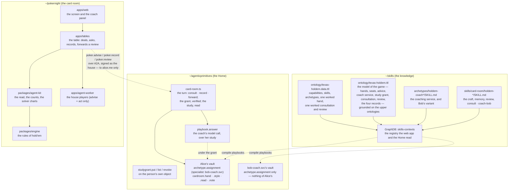

# How your own agent — and the coach it consults — advise you at a hold'em table

*The whole journey, from a text file somebody wrote to a sentence on your screen — for anyone, technical or not.*

Status: as-built, 2026-09-12. The engineer's map of the same ground is `docs/HOLDEM-COACH.md`; the rules the code is held to are in `CLAUDE.md`; the story of what it is like to have a coach is `docs/articles/my-poker-coach.md`. This document is the mechanism, with pictures.

---

## 0. The one-paragraph version

You sit at a hold'em table on **poker.faithnet.io**. When it is your turn, the card room works out the facts of your spot (the pot, what a call costs, your outs, your position) and asks **your own agent** — the one that lives at your Home, **alice.me** — what you should do. Your agent does not work it out itself: it **consults the coach you hired**, a small service Bob runs called **bob-coach.svc**, and hands it the same question together with a **study grant** you signed — permission for that coach, and only that coach, to read your own records: the hands you have played, the style you wrote down for yourself, your notes on other players, and the notes the coach left last time. The coach reads them at *your* vault, reasons from a **playbook** of skill documents somebody wrote in plain English (how to read a hand, each street, how to use your records, how to review), and answers in one sentence with the reason and a move. Your screen says exactly who spoke: *"bob-coach.svc, via alice.me"*. After each hand the card room sends your agent what happened at your seat and what everybody did, as counts, and your agent files it in your vault — no thinking, no tokens. When you ask *"how have I been playing?"*, your agent forwards that to the coach, which reads the hands on file and answers. Nothing anyone says is ever played for you; you press the button or you don't. And the only tokens spent on a hand are the coach's, on the coach's own account — never yours, never the house's.

---

## 1. The cast



**In plain words.** There are three worlds. The **card room** deals the cards and runs the table; it talks to exactly one agent on your behalf — yours — and never learns where your coach is. The **skills estate** is where the knowledge lives: text files an author writes, published as versioned artifacts, catalogued in a registry, and a formal model of the game (the *texas-holdem* ontology) that says what a hand, a decision, a coach, a grant and a review *are*. **The Home** is where agents live with their vaults: your agent and your vault, and Bob's coaching service — a separate agent Bob chartered and custodies, which holds nothing of yours.

Four things can advise at a table, and you choose:

| Adviser | What it is | Costs |
|---|---|---|
| **House coach** (default) | A rules engine inside the card room, backed by solver charts | nothing |
| **A house player** (Sharkbot, The Rock, Deep Thought…) | The same rules engine, biased into a style | nothing |
| **Your own agent** (alice.me), with no coach named | Refuses politely; the house answers, and the screen says so | nothing |
| **Your own agent, consulting the coach you hired** (bob-coach.svc) | A language model on the coach's account, reasoning from its playbook and your records | the coach's tokens — the panel says so before you pick it |

The house never spends tokens. Your own agent never spends tokens at a table. The only language model in the room is the coach a person hired, and it runs on the coach's account.

---

## 2. From a text file to a playbook — two of them

*How skills written by people become what Alice's agent and Bob's coach play by.*



**In plain words.** A skill is a short essay in a `SKILL.md` file — *"the price of a call is toCall ÷ (pot + toCall)… never fold when checking is free…"*. Publishing it makes a numbered, fingerprinted copy nobody can quietly change. The registry is the catalogue, and its **texas-holdem** context now describes two kinds of agent:

- **Your own agent** carries one small skill for the card room, `holdem-consult`: accept the table's question, look up the coach you named, present your grant, return the coach's words in the coach's name; put each finished hand in your vault; forward a review. It says, in so many words, *"you generate nothing"*.
- **A coaching service** carries the craft: the table read, the four street skills, `holdem-memory` (what each of your records is and how much a count is worth), `holdem-review` (how to review a session), and — for Bob's service only — `coach-bob`, his own convictions (*price before player; raise or fold, never limp; a right decision that lost is still right*).

When your Home assigns the person-steward playbook to your agent, it also writes one line into it: **for `poker.advise`, the specialist is `bob-coach.svc`**. That line is behaviour, not authority — it says who to ask, never what they may see. What they may see is the grant.

**The words, defined once.**

- **Capability** — a thing an agent can do, by name. `poker.advise` (say what to do from a seat), `poker.record` (keep a finished hand), `poker.review` (look back over the hands on file), `poker.act` (take a turn — only the house players carry this; a coach is not a player).
- **Skill** — a `SKILL.md` document: the *how*.
- **Archetype** — a blueprint for a kind of agent: which capabilities it has and which skills it carries. Yours is *person steward*; Bob's service is *holdem-coach-bob*.
- **Specialist** — a line in your playbook naming who does a capability for you. Yours says a service does `poker.advise`.
- **Study grant** — a signed permission from you to one service: read these four records of mine, append to one of them, until this date, revocable on chain. The coach's whole access, and the thing you revoke to fire it.

---

## 3. One hand: from the deal to the advice on your screen



**In plain words.** When it's your turn, the screen asks the card room for advice. The card room does the arithmetic first — the model is never asked to compute a percentage, because it gets those wrong; it is *handed* the numbers. It also asks its own rules coach for a baseline. If the solver charts have seen this exact spot dozens of times and always agreed, the house answers and nobody's tokens are spent. Otherwise the card room signs the question **as the house** and sends it to **your agent** — the only address it has. Your agent does not think about poker at all: it looks up which coach you named, fetches the grant you signed for that coach, and passes the question on with the grant beside it. The coach checks the grant, reads your records at *your* vault (they never travel in the message), and answers from its playbook — the shared craft, the stage skill for this street, what your records say, and Bob's own way of coaching. The answer comes back through your agent, and the screen says both names. Fourteen to seventeen seconds, door to door.

**If anything is missing, the house answers and the screen says so.** No coach named in your playbook, no grant stored, a grant that has expired or been revoked, or a coach that is too slow: your agent refuses in one line, the card room falls back to the house coach, and the panel tells you which of those it was. That is the correct failure — the house is right about the mechanics every time, and nobody is ever left mid-hand with nothing.

Three things a coach is held to, by the code and by the ontology:
- **It sees only what your seat sees.** Your two cards and the board — never anyone else's cards. Advice built on hidden cards would teach a way of playing you can never reproduce alone.
- **It reads only what you granted.** Four records, at your vault, under a grant you can revoke. Your hands never sit on the coach.
- **Advice is evidence, never authority.** The card room applies nothing it returns. You press the button.

---

## 4. After the hand: the record, and the review when you ask



**In plain words.** The card room keeps no record of how anybody plays — it has nowhere to put one. What it does is *report* each finished hand to your agent, which files it in your vault: the hand as you saw it, and the counts. That costs nothing, because filing is not thinking. Next hand, the coach reads those counts back with the rates worked out (*"folds to a bet 80% of the time, over 5"*), and its skills teach what they mean and how much a number is worth at each sample size.

A **review** is different, and it is yours to ask for. Press *Review my hands* (or ask in your own words — *"how did Thursday go?"*, *"was I right to fold that turn?"*) and your agent forwards the question to the coach with your grant. The coach reads the hands on file and answers the way a coach talks after a session: how many hands, what happened, the decisions that mattered with the price and what they cost, one leak with the count behind it, one thing to change. It leaves one short note in **your** cabinet so that next session's advice starts where this review ended. A hand ending never triggers a review; only you do.

---

## 5. Where everything lives



**In plain words.** Three repositories, three jobs. **skills** holds the knowledge and the model of the game: the *texas-holdem* ontology says what a hand, a seat, a decision spot, a piece of advice, a coach service, a study grant, a consultation, a hand record and a review *are*, in the same terms every other domain uses — and the skill documents are attached to the archetypes through it. **agenticprimitives** is the Home: where a person's agent and a coach's service run, where the grant is stored and verified, and where the vaults are — one each, with nothing of Alice's on Bob's. **pokernight** is the card room: the rules of the game, the arithmetic of a read, the solver charts the house plays by, the table, the screen, and the house players.

The charts deserve one sentence: the house coach's baseline is not folklore. It's a lookup built from 560,000 solver-labelled decisions (PokerBench), scoring 91% preflop and 80% postflop against the solver's held-out set, and when the solver itself splits on a spot the baseline says so — which is exactly where the coach's reading of your records on the player across the table earns its keep.

---

## 6. What must always be true

These are held by tests in all three repositories, and by the vault itself:

| Invariant | Where it is held |
|---|---|
| The table addresses **your agent** mid-hand, never the coach and never Bob | the table stores one endpoint per player — yours; `apps/tables/test/adviser.test.ts` |
| Your agent's `poker.advise` **calls no model** | `card-room.test.ts` — the turn consults or refuses, and nothing else |
| `poker.record` **calls no model** — it is a vault put | `card-room.test.ts` |
| The grant's delegate is a **service** (`.svc`), never a person | `studygrant.put` refuses anything else; `verifyStudyGrant` |
| The grant reads your four records and writes **only the coach's note** | `verifyStudyGrant` refuses a wider grant whole |
| A **service cannot hold your records** in its own vault | the vault refuses `cardroom.hand/style/read/note` on a service principal |
| A hand ending **never messages the coach** | `recordWithAdvisers` sends to your agent only; `card-room.test.ts` |
| `poker.act` ≠ `poker.advise` ≠ `poker.record` ≠ `poker.review` — four skills, advertised separately | `adviser.test.ts`; the house players advertise neither record nor review |
| Two seats, two grants — one person's grant is never used for another | `card-room.test.ts` |
| **One cabinet per game, one coach per game** — hold'em's records are `cardroom.hand…`, canasta's `cardroom.canasta.hand…`; a hold'em grant reads nothing of canasta's | `studyRecords`, `verifyStudyGrant(family)`; `card-room.test.ts` "one cabinet per game" |
| **Your profile is yours** (`cardroom.profile`) — read by every coach you hire, written by nobody but you | the vault admits it on your own `record.put` and refuses it on a service principal |
| A **leak is a count**, a **plan is one change**, **progress is two numbers** — never a verdict | the review returns `leak {pattern, count, of, cost}` and measures against the last note's plan |

---

## 6½. Two games, one arrangement

Everything above was written for hold'em and Bob. On 2026-09-13 canasta got its own coach — **Carol's**
(`carol-coach.svc`, custodied by carol.me) — and the arrangement turned out to need no second design,
only a second *rule book*:

```
                       your agent (alice.me)
  poker.advise  ─────►  specialist: poker.advise   → bob-coach.svc    reads cardroom.hand|style|read|note
  canasta.advise ────►  specialist: canasta.advise → carol-coach.svc  reads cardroom.canasta.hand|style|read|note
                                                       both read       cardroom.profile  (yours, one across games)
```

- **A coach knows one game.** Bob's card advertises `poker.advise`/`poker.review` and nothing of canasta's;
  Carol's the reverse. The specialist line in your playbook is per skill, so the two coaches sit side by side.
- **Two grants, two cabinets.** Firing Carol revokes her grant and leaves Bob's alone, and the canasta rounds
  can never reset the hold'em counts (one record for two games was a record for whichever wrote last).
- **The ontology says it once.** `~/skills/ontology/card-room.ttl` is what both games derive from: the player as a
  role, the coach service and its doctrine, the study grant and the engagement, the consultation and the review,
  the cabinet, and the learning — your **profile** and **goals**, the **leak** with its count, the **one plan**,
  and **progress** measured between two spans. `texas-holdem.ttl` and `canasta.ttl` each import it and specialize
  twenty-two classes; a third game is a third rule book, not a third coaching arrangement.
- **The review answers your goals first.** Under Settings → Coaches at your Home you say where you are at each
  game, how you want to be spoken to, and what you want to get better at. Every coach reads it under its grant:
  a *new* player gets the rule named before the move; *only when I ask* gets the move and nothing else; and a
  review opens with your goal, measures the last plan's count against its count now, and only then says what it
  found on its own.

---

## 7. Glossary, in plain words

| Word | Meaning here |
|---|---|
| **A2A** | Agent-to-agent: the standard way one agent sends another a message and gets an answer. The card room and your agent talk this way; so do your agent and the coach. |
| **Home** | The place your own agent lives (faithnet.me). It holds your vault and signs things for you; the card room never holds your keys. |
| **Vault** | Your agent's private records. Your playbook, your hands, your style, your reads and the coach's notes are five of them. |
| **Archetype** | A blueprint for a kind of agent — which capabilities and skills it carries. Yours is *person steward*; Bob's service is *holdem-coach-bob*. |
| **Capability** | A named thing an agent can do: `poker.advise`, `poker.record`, `poker.review`, `poker.act`. |
| **Skill / SKILL.md** | A plain-English document of *how* to do something. |
| **Playbook** | All of an agent's skills compiled into one document, fingerprinted, stored in its vault. |
| **Specialist** | A line in a playbook saying who does a capability: yours names `bob-coach.svc` for advice. |
| **Coach service** | A Smart Agent a coach custodies (`bob-coach.svc`): consulted by your agent, never by the table; reads your records under your grant. |
| **Study grant** | Your signed permission for one coach service to read your four study records and append its notes, until a date, revocable on chain. |
| **The read** | The facts of your spot, computed by the card room: pot, price, outs, position, money behind, the hand so far. |
| **Baseline** | The house coach's own answer for the spot, sent along so the coach starts from something right about the mechanics. |
| **Certain** | The solver saw this exact spot many times and never disagreed — so the house answers and nobody is asked. |
| **Mixed** | The solver itself splits (bet 32% / check 68%) — carried as such, so your records can pick a side. |
| **Record** | The card room telling your agent how a finished hand went — the hand as you saw it, and the counts — to file in your vault. No model. |
| **Review** | Your question about your past hands, forwarded by your agent to the coach, answered from the hands on file. |
| **Registry / GraphDB** | The catalogue of ontologies, capabilities, skills and archetypes that the website shows and the Home compiles from. |
| **Ontology** | The formal model of what things are — a hand is a *situation*, the rule book is a *description*, a coach service is a *service agent*, a study grant is a *delegation* — shared across every domain so they can be reasoned about together. |
| **The house** | The card room's own service identity. It deals, it asks your agent on your behalf, and it spends no tokens. |

---

## 8. Where to look in the code

| Step | Where |
|---|---|
| The skills | `~/skills/skills/card-room/holdem-*/SKILL.md`, `coach-bob/SKILL.md` |
| The archetypes | `~/skills/archetypes/holdem-coach/SKILL.md`, `holdem-coach-bob/SKILL.md`, `person-steward/SKILL.md` |
| The model of the game | `~/skills/ontology/texas-holdem.{ttl,clusters.ttl,data.ttl}` (§8b COACHING) |
| Registering the archetypes | `~/skills/scripts/register-holdem-coach-bob.mjs`, `publish-ontology-skills.mjs` |
| Chartering and binding, at the Home | `~/agenticprimitives/scripts/charter-coach.mts`, `bind-coach-specialist.mts`, `seed-cardroom-style.mts`, `add-cardroom-skills.mts` |
| The turn: consult, record, forward; the grant | `~/agenticprimitives/apps/demo-a2a/src/card-room.ts` (+ `test/card-room.test.ts`) |
| The coach answering over her study | `~/agenticprimitives/apps/demo-a2a/src/playbook-answer.ts` |
| The grant on the person's object; the vault's refusal | `~/agenticprimitives/apps/demo-a2a/src/interactions-do.ts` (`studygrant.*`, `internal.coordination.vaultWrite`) |
| The read, the counts, the charts | `packages/agent-kit/src/{explain,observe,preflop-chart,postflop-chart}.ts` |
| The table asking, recording, forwarding | `apps/tables/src/table-do.ts` (`/advice`, `/review`, `askAdviser`, `recordWithAdvisers`), `apps/tables/src/a2a.ts` |
| Signing as the house | `apps/tables/src/house-caller.ts` |
| The screen | `apps/web/src/components/PokerCoach.tsx` (the panel, *Review my hands*), `Coach.tsx` (the adviser picker), `lib/whoIsWho.ts` |
| The house players | `apps/agent-worker/src/personas.ts` (advise + act; no record, no review) |
