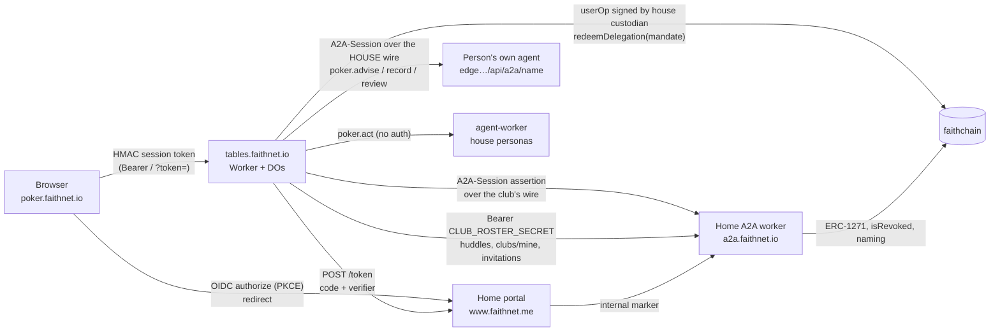

# Poker Night — technical architecture and security audit

**Date:** 2026-09-13 · **Audited commits:** pokernight `2e3a52d`, agenticprimitives `d6f036d5`, skills `e72f4c8`
**Scope:** the card room (`apps/tables`, `apps/web`, `apps/agent-worker`, `packages/*`, `contracts/`) and every surface of the Agentic Primitives substrate it depends on (the Home portal's OIDC broker and ceremonies, the A2A worker's session-wire gate, club and huddle doors, the interactions vault, the on-chain delegation contracts).
**Purpose of the deployment under audit:** public **testing and play-money play**. The verdict is given against that purpose. A separate section lists what would have to change before any real value moved.

---

## 0. Verdict

**Fit for public play-money testing, with five conditions.** The controls that decide *who a person is* (Home OIDC with PKCE, single-use codes, id_token verification with issuer allow-list, nonce and age bounds), *who an agent is* (session wires verified against the delegator's own ERC-1271, pinned to one selector, unrevoked on chain, single-use assertions), and *who may move money* (a buy-in mandate the person signs at their Home, bound to one treasury, one asset, one payee and a spend cap, redeemed on chain through caveat enforcers) are sound and were traced end to end. The coin is an open-mint test asset by design and the settlement path refuses to open a table in anything else.

Conditions (each is a finding below):

1. **Do not add a language-model persona to the agent worker until its A2A surface has admission** — today it admits every caller (P-01).
2. **Rotate the two shared secrets** (`CLUB_ROSTER_SECRET`, `OPERATOR_TOKEN`) and treat the club-side secret as a temporary bridge to be replaced by a wire (P-03).
3. **Put a rate-limit rule in front of the club and auth routes** at the Cloudflare edge; nothing rate-limits today and a club read costs a Home round-trip (P-05).
4. **Add a Content-Security-Policy on the web worker**; session material lives in browser storage (P-07).
5. **Keep `ASSET` pointed at the open-mint Sheqel.** The faucet and new-player seed are gated on the asset itself simulating an open mint; a real asset must never be configured (P-14).

**Not fit for real money.** Section 7 lists the blockers: trusted dealer, the house custodian key as a worker secret, single session key across all club wires, no third-party contract audit on the substrate, no durable audit sink on the signing service.

---

## 1. Method

Manual code review of the two repositories at the pinned commits, following each trust decision from the request that makes it to the code that enforces it, with the relevant file and line cited. Where a control depends on a live deployment (Cloudflare secrets, Vercel headers, the chain), the deployed configuration was checked against the source. Test suites were run (§6). Dependency advisories were pulled with `pnpm audit --prod` (§6). Nothing here is inferred from documentation alone; where documentation and code disagreed, the code is what is reported.

Severity is rated for the stated purpose (public, play-money testing): **High** — could expose a person's identity, another person's data, or an operator's keys, or make the service unusable; **Medium** — a real weakness with a bounded blast radius or a precondition; **Low** — hygiene, defence in depth, or a documented trade-off worth stating; **Info** — an architectural fact a reviewer needs.

---

## 2. Architecture

### 2.1 Components

| Component | Runs as | Holds | Talks to |
|---|---|---|---|
| **Card room** `apps/tables` | Cloudflare Worker + Durable Objects (`PokerTableDO`, `LobbyDO`, `SessionDO`) + KV `CLUB_WIRES` | game state, chips, session records, the wires clubs signed | the Home (OIDC token exchange, club acts, huddles), faithchain (settlement, naming), agent personas (A2A turns), people's own agents (advice, records) |
| **Web client** `apps/web` | Cloudflare Worker serving a Vite SPA + `/sso-logout` | session token (localStorage), ceremony stashes and (demo only) a Home bearer (sessionStorage) | tables API, the Home (ceremonies by redirect), RealtimeKit (WebRTC) |
| **Agent worker** `apps/agent-worker` | Cloudflare Worker | nothing persistent; five rules-based house personas | is called by tables for `poker.act` / `canasta.act` |
| **Contracts** `contracts/` | faithchain (chain 34348) | `Sheqel` — an `AppCurrency` ERC-20 with an **open** mint | — |
| **Home portal** (substrate, `apps/demo-sso-next`) | Vercel (Next) + KV | OIDC codes, grant records, invitation stashes, demo-persona custody | the A2A worker, the chain |
| **Home A2A worker** (substrate, `apps/demo-a2a`) | Cloudflare Worker + DOs (`InteractionsDO` vault, `A2aTaskDO`, huddle rooms) | every agent's records and grants, KMS custody roots | the chain, RealtimeKit, the card room (as a wire caller) |
| **Delegation contracts** (substrate) | faithchain | `DelegationManager`, caveat enforcers (timestamp, allowedTargets, allowedMethods, payment, …), `AgentAccount`, `UniversalSignatureValidator` | — |

### 2.2 Trust boundaries and what crosses them

Every arrow's authority, and where it is checked:

| Arrow | Credential | Verified by | Cited |
|---|---|---|---|
| Browser → tables | HMAC-SHA256 session token over `playerId.name.exp`, 12 h, backed by a `SessionDO` record (sign-out = revocation) | `auth.ts` `verifySessionToken`, `hydrateHomeSession` | `apps/tables/src/auth.ts:97-124,156-190` |
| Browser → Home → tables (sign-in) | OIDC code + PKCE S256 + state + nonce; **code exchanged server-side by the Worker**, never by the browser | Home `server/token.ts:125-151` (single-use, verifier, redirect_uri exact); tables `home.ts:167-217` (issuer allow-list, `aud`, nonce, `exp`, `iat` ±2 min / 15 min) | both cited |
| tables → Home A2A (as a club) | `A2A-Session` assertion: session-key ECDSA over (agent, method, body hash, issuedAt, audience), wrapped with the club's custodian-signed wire; spent once | `packages/a2a/src/standard/caller.ts:137-206`, `session-wire.ts:104-175`, claim ledger `a2a-task-do.ts:891-902` | cited |
| tables → person's agent (as the house) | same assertion shape over the house wire; selector pinned to `harness.ask`; 90-day validity | `apps/tables/src/house-caller.ts`, `scripts/mint-house-wire.mts:73-81` | cited |
| tables → Home (huddle actor, club lists) | shared bearer secret, constant-time compared at the Home | `demo-a2a/src/index.ts` `clubRosterSecretOk` | see P-03 |
| tables → chain (settlement) | house custodian EOA signs the **userOpHash** only; `AgentAccount.execute` is EntryPoint-gated; a player's buy-in is `redeemDelegation(mandate)` with the person's own signature on the mandate | `packages/treasury/src/client.ts:167-181`, `mandate.ts:85-140` | cited |
| Worker → DO | `x-player-id` / `x-player-name` headers set by the Worker on a fresh `Headers` object; DOs are reachable only through the binding | `apps/tables/src/index.ts:1631-1640`, `table-do.ts:1134` | Info |
| Home portal → Home A2A internal ops | `x-ap-internal` marker; internal ops refuse without it | `demo-a2a/src/internal-marker.ts:55`, `interactions-do.ts:1877,3412` | cited |

### 2.3 Where a club lives (decided 2026-09-13)

A club **is** a `.workspace` Smart Agent its host custodies at the Home; the card room keeps nothing of it but the wire (`CLUB_WIRES` KV). Membership is the workspace's own `org.membership:member:<sa>` records written by the Home's invite/join ceremonies; the club's profile, schedule and night exceptions are three records in the workspace's vault written by the club's agent when the card room acts as it (`club.read` / `club.write`, no model). Standing (host/member/none) is derived by the Home from its records and the chain on every read; a positive answer is memoised for 60 s, `none` never. Nights are derived from the schedule rule at read time. `docs/WORKSPACES.md` §5.0.

### 2.4 Money

One currency, pinned per table at creation (`meta.asset`, `meta.chipValue`). A **buy-in mandate** is a delegation the person signs at their Home: delegator = their treasury, delegate = the house, caveats = payment cap per charge, aggregate cap, count and window, `allowedTargets` = the asset, `allowedMethods` = `transfer`, payee = the house treasury, timestamp window. The table reads the mandate from the person's `SessionDO` record, checks the treasury it is bound to and the asset it names against the table's (`table-do.ts:2555-2580`), and the house redeems it on chain; the chain's enforcers (not the card room) decide whether the transfer is within the mandate. Cash-outs are house-treasury → person-treasury transfers signed by the house custodian. Sheqel's `mint` is open (`contracts/src/AppCurrency.sol:74`) — the faucet and seed are gated on `isTestAsset` (`treasury.ts:359`), which simulates a mint rather than trusting a flag.

### 2.5 The deal

The host draws a 32-byte seed with `crypto.getRandomValues` (`packages/deal/src/index.ts:35`), publishes `sha256(seed)` at hand start, keeps the seed in DO storage during the hand, and reveals it with the full event log at hand end (`table-do.ts:2240,2381-2390`). Any finished hand replays byte-identically from (seed, action log); tests assert this. Hole cards and the deck leave the DO only through `viewFor` / `redactEvent` (`table-do.ts:842,921,1168`). This is a **trusted-dealer** design: the operator holds the seed mid-hand (§7).

---

## 3. Findings — card room

### P-01 · High (conditional) · The agent worker admits every caller
`apps/agent-worker/src/index.ts:65-72` — the A2A server is built with `principal` deliberately omitted ("PHASE 2: NO ADMISSION"). Anyone on the internet can drive the house personas' `poker.act` / `canasta.act`. Today every persona is `strategy: 'rules'` (`personas.ts:52-93`) so the cost is CPU only. The moment a `'claude'` persona is enabled (`strategies/claude.ts`, `ANTHROPIC_API_KEY`), this becomes an unauthenticated token faucet.
**Recommendation:** wire `sessionWirePrincipal` (the deps are already sketched in the comment) and require the caller to be the tables worker's house agent; add an edge rate limit on `/api/a2a`. Block any LLM persona on this check.

### P-02 · Medium · One session key is the delegate for the house wire and every club wire
`apps/tables/src/clubs.ts:43-56` derives the club delegate from `HOUSE_A2A_SESSION_KEY`; `house-caller.ts:55` signs with the same key. A leak of that one secret lets the holder act as the house to every person's agent **and** as every club at the Home (club records, roster reads) until each wire expires or is revoked. Mitigations in place: wires are per-rail selector-pinned (`harness.ask` only), time-bounded (90 days), on-chain revocable by each custodian, and the assertion is single-use and body-bound.
**Recommendation:** derive a per-club delegate key (HKDF from a root secret + club address) so a revocation is per club, or at minimum a separate key for clubs; record each wire's `validUntil` and rotate the house wire before 2026-12-10 (minted 2026-09-11, 90 days).

### P-03 · Medium · `CLUB_ROSTER_SECRET` is a bearer that can name any actor and read any person's club links
The Home's `/huddles/:op` (club scope), `/clubs/mine` and `/clubs/invitations` accept the paired secret in place of a person's session (`demo-a2a/src/index.ts`, `clubRosterSecretOk`; constant-time). The Home still **derives** standing for the huddle, so the secret cannot admit a stranger — but it can join a huddle *as* any real member, and it can list which clubs any address belongs to or has been invited to. The secret is held by both workers.
**Recommendation:** replace with an `A2A-Session` assertion over the house wire (the same mechanism `/clubs/act` already uses), scoped to these three operations; until then rotate it and alert on use from any origin but the tables worker.

### P-04 · Medium · The host's Home id_token is returned to the browser and travels in a query string
`POST /clubs/charter` returns `idToken` (`apps/tables/src/index.ts:630`) because the Home's `service-agent-wire` ceremony needs it as `collect_token`; `startClubWire` puts it in the authorize URL's query (`apps/web/src/lib/home.ts`). It therefore lands in browser history, the Home's request logs, and any referrer. The token is identity-only (no bearer authority at the card room), 15-minute bounded, and the Home presents it to `/admin/*` which verifies it — but a captured token could push a **valid, custodian-signed** wire it had no business pushing only if the attacker also custodies that club, so the practical impact is exposure of identity claims.
**Recommendation:** carry it in the URL fragment, or have the Home mint a short one-time `collect_token` at `/clubs/charter` time; strip it with `history.replaceState` on arrival (the card room already strips `code`).

### P-05 · Medium · No rate limiting; club routes are Home round-trips
No route on `tables.faithnet.io` is rate-limited (no limiter in `index.ts`, no Cloudflare rule). `GET /clubs/:id`, `/tables?club=`, `/clubs/:id/huddle/*`, every club-table gate and the WebSocket upgrade each cost one `club.read` at the Home (~2 s: four vault reads plus a standing derivation), and `/clubs` costs a walk of the person's links. A single session can generate sustained DO work at the Home.
**Recommendation:** Cloudflare rate-limiting rules per IP and per session on `/clubs/*`, `/auth/*`, `/me/*`, `/tables/*/ws`; a 5–15 s in-Worker memo of `club.read` keyed by (club, agent); and a per-club concurrency cap on `/clubs/act` at the Home.

### P-06 · Medium · WebSocket token in the query string
`GET /tables/:id/ws?token=…` (`index.ts:1631`). Query strings are logged by intermediaries and appear in browser history. The token is the full 12-hour session credential.
**Recommendation:** send it as a `Sec-WebSocket-Protocol` value or as the first frame; or mint a short-lived, table-scoped socket ticket from the session.

### P-07 · Medium · Session material in browser storage, no CSP on the web worker
The card-room session is in `localStorage` (`apps/web/src/lib/api.ts:134-156`); ceremony stashes and (demo personas only) the person's **Home bearer** are in `sessionStorage` (`home.ts` `HOME_SESSION_KEY`; `quickConnect.ts:35`). Neither worker sets a `Content-Security-Policy`, `Strict-Transport-Security` or `X-Content-Type-Options` header (`apps/web/worker/index.ts`, `apps/tables/src/index.ts`); the Home portal does (`next.config.mjs:15-40`). An XSS on `poker.faithnet.io` is a full session takeover and, for a demo persona, a Home takeover.
**Recommendation:** a CSP on the web worker (`default-src 'self'; script-src 'self' https://cdnjs.cloudflare.com; connect-src 'self' https://tables.faithnet.io https://a2a.faithnet.io wss: https://*.realtime.cloudflare.com; frame-ancestors 'none'`), HSTS on both, and drop the Home bearer from the browser once quick-connect can use a server-side handoff.

### P-08 · Low · Session HMAC signs a delimiter-joined string, not the payload bytes
`auth.ts` `signingInput` is `` `${playerId}.${name}.${exp}` `` while the payload is JSON. A display name containing `.` makes two claim sets share a signing string. Not exploitable today (`playerId` has no `.`, `exp` is a 13-digit integer and a forged future `exp` would need a non-representable double), but it is a latent ambiguity.
**Recommendation:** HMAC the exact base64url payload bytes.

### P-09 · Low · Demo sign-in accepts a bearer id_token with no nonce
`POST /auth/home/demo` (`index.ts:244-257`) mints a session from an id_token the browser presents, bounded only by `iat` age (15 min, `home.ts:35`). A captured demo id_token can be replayed for that window. Demo personas are shared, public accounts by design.
**Recommendation:** keep the route behind a deployment flag; bind the demo exchange to a nonce as the OIDC path is.

### P-10 · Low · A practice table can be watched by anyone who knows a player's address
Practice table ids are `sha256(playerId + game)` (`practice.ts`), practice tables have no club, and `GET /tables/:id` serves a spectator view without a session (`index.ts` `clubGate` passes when there is no club). Hole cards are redacted for spectators; what leaks is that the person is playing, and their stack.
**Recommendation:** gate `GET /tables/:id` and the socket to the owner when `meta.practice` is set.

### P-11 · Low · Club wires have no tracked expiry
`storeClubWire` returns `expiresAt: null` and nothing records the wire's timestamp window; when it lapses (90 days), every club route answers `404 no such club` with no operator signal (`clubs.ts:78-98`).
**Recommendation:** decode and store `validUntil`, surface "authorisation expires on …" to the host, and add the "finish setting up" road (`WORKSPACES.md` §5.0 follow-ups).

### P-12 · Low · Operator actions are not audit-logged
`DELETE /tables/:id/seat/:seat` and `DELETE /tables/:id` under `x-operator-token` (constant-time compared over SHA-256 digests, `operator.ts:42-78`) move chips and retire tables with no durable record of who did what.
**Recommendation:** log operator calls to a durable sink (Workers Logs / Analytics Engine) with table, seat, and outcome.

### P-13 · Low · Dependency advisory
`uuid <11.1.1` (moderate, GHSA-w5hq-g745-h8pq) via `@cloudflare/realtimekit-react → @cloudflare/realtimekit`. Client-side only.
**Recommendation:** bump when RealtimeKit publishes; `pnpm overrides` in the meantime.

### P-14 · Info · The coin is open-mint by design
`AppCurrency.mint` is callable by anyone (`contracts/src/AppCurrency.sol:74`; the header states the intent). Play money only. The card room refuses to open a table in an asset it cannot read, and the faucet/seed are gated on the asset simulating an open mint (`treasury.ts:359`), never on a flag.

### P-15 · Info · A finished hand is public, including hole cards
`GET /tables/:id/hands/:handNo` returns the seed reveal, the full event log and the result once the hand is over (`table-do.ts:1113-1121`). This is the verifiability property; it is worth saying on the table page.

### P-16 · Info · The house custodian key is a Worker secret
`HOUSE_CUSTODIAN_KEY` signs userOpHashes for the house Smart Agents (`treasury/src/client.ts:174`). It cannot move the asset directly (`AgentAccount.execute` is EntryPoint-gated) but it authorises house-treasury transfers. Acceptable for a test coin; see §7.

### P-17 · Info · Verified sound
- `ALLOW_AGENT_ENDPOINT` (caller-supplied agent URLs, an SSRF primitive) is set only in the dev `[vars]` block (`wrangler.toml:72`) and absent in `[env.faithnet.vars]`.
- Every WebSocket frame is JSON-parsed and validated through `parseClientCommand` before a seat is consulted; spectators cannot send commands (`table-do.ts:1176-1191`).
- Club standing is asked of the Home per request and never stored; a club nobody has standing in answers 404, never 403.
- Each `club.act` request carries a nonce so parallel reads do not collide on the single-use assertion ledger (`clubs.ts` `actAsClub`).
- `/admin/*` (the wire ceremony) admits only the Home's origin for CORS and verifies a Home id_token as its bearer; a wire is checked for shape, delegate and the club's own ERC-1271 signature before it is kept (`clubs.ts:78-98`).
- Secrets: `SESSION_SECRET`, `OPERATOR_TOKEN`, `HOUSE_CUSTODIAN_KEY`, `HOUSE_A2A_WIRE`, `HOUSE_A2A_SESSION_KEY`, `CLUB_ROSTER_SECRET`, `RPC_TOKEN`, `ANTHROPIC_API_KEY` are Worker secrets; none appears in `wrangler.toml` or git; `.house-key.json` / `.house-a2a-session.json` / `.dev.vars` are ignored. A scan of tracked files found only transaction hashes and a test sentinel among 64-hex strings.
- The repository links to no private checkout; `@agenticprimitives/*` are exact-pinned npm versions.

---

## 4. Findings — substrate, as the card room consumes it

### S-01 · Positive · OIDC broker
`server/token.ts:125-151`: code deleted before use regardless of outcome, PKCE S256 verified, `redirect_uri` must equal the bound one; `server/oidc/authorize-grant.ts:63-81`: `client_id`, `redirect_uri`, `code_challenge`, template required; template must be in the client's registered list; the **delegate is taken from the registry, never the request**. Poker Night's registration carries six curated templates and now `requireNamedAgent: true`.

### S-02 · Positive · Session-wire admission
`packages/a2a/src/session-wire.ts:104-175`: timestamp window, `allowedMethods` present and never the any-skill sentinel, the requested skill's selector present; signature recovers to the wire's delegate; the wire's own signature verified against the **delegator's** account (ERC-1271 through `UniversalSignatureValidator`); `isRevoked` checked; chain-read failure fails closed. `standard/caller.ts:137-206`: audience = request origin, body hash over the raw bytes, method bound, age ≤120 s, and the digest **spent once** on the agent's own object (`a2a-task-do.ts:891-902`, with expiry sweep).

### S-03 · Medium · Vault-record scope is enforced off chain
`packages/delegation/src/caveats.ts:28-30`: `VAULT_RECORD_SCOPE_ENFORCER` is a sentinel address; the study grant a person signs for a coach (`vault:cardroom.*` reads, `cardroom.note` append) is scoped by the interactions DO (`interactions-do.ts:4016-4021,1995`), not by the chain. Consequence: the grant is unredeemable on chain (a sentinel enforcer reverts), which is desirable; but the scope's correctness is a property of Home code and its tests, and any vault runtime that skipped the check would honour the grant as unlimited read.
**Recommendation:** keep the scope check covered by tests that pin the regexes; document the sentinel model in the study-grant spec; consider a scope hash in the delegation `terms` so a mismatched runtime fails closed.

### S-04 · Medium · Custody signing endpoint signs any 32-byte digest for a custody-grade session
`demo-a2a/src/index.ts:6976-7010` (`/custody/oidc/sign`): given a verified custody session, derives the per-subject KMS custodian and signs `hash`. Gates: session must be custody-grade, `sa_mismatch` check, sender must be the SA or an account it custodies, CSRF double-submit, audit sink. The Home session token of an email/Google/phone person is therefore a signing oracle for their Smart Agent for the session's life — every delegation the card room ever receives from such a person was minted this way.
**Recommendation:** typed-data gating (accept only EIP-712 digests whose type the broker composed in the same request), a short TTL for the custody-grade session, and per-op consent for high-value types (mandates, stewardship).

### S-05 · Medium · Workspace-invite stash trusts a KV projection for stewardship
`server/connect/workspace-invite.ts:~100`: the custodian leg checks `related:<person>:<workspace>` in KV (`relationship: 'steward'`) rather than deriving standing from the chain. The stash is single-use, 7-day TTL, and the wires inside it are custodian-signed and verified where used, so a stale row cannot mint authority — it can only let a former steward overwrite a pending invitation.
**Recommendation:** use `deriveStanding` (chain-checked stewardship) at stash time.

### S-06 · Low · `club.write` accepts any value
`card-room-club.ts:115-127`: the three club records are replaced whole with the caller's value, stamped with `updatedAt`; there is no schema at the Home. A card-room bug could persist malformed club records.
**Recommendation:** validate `profile` / `schedule` / `nights` with the ontology-derived shapes at the Home.

### S-07 · Low · Dependency advisories
`pnpm audit --prod`: 16 findings (2 low, 14 moderate) — Hono `parseBody` nesting, query-parser and `toSSG` advisories, Mermaid (DoS/CSS), DOMPurify, body-parser. The card room's own Hono is 4.13.7 (clean).
**Recommendation:** bump `hono` in `demo-a2a`; Mermaid/DOMPurify are documentation-site dependencies.

### S-08 · Info · Test health
`demo-a2a`: 878 tests, 1 pre-existing failure unrelated to the card room (`harness-team-create` ceremony negotiation offers `calendar.event.create`); a full parallel run once showed 26 files failing to *load* (resource contention), clean on rerun. `demo-sso-next`: type-checks clean.

### S-09 · Info · Inherited open items from the substrate's own threat model
`docs/audits/threat-model.md` §10: **CT-1** deployer EOA controls live governance (P0); **CT-4** no third-party contract audit (P1); **CT-8** the signing/custody service emits audit only to console (P1); **CT-5** paymaster sponsorship budget not enforced (P2); **CT-6** per-tool KMS key isolation not implemented (P2). None is a play-money blocker; all are real-money blockers.

### S-10 · Positive · Contracts and CSRF
`DelegationManager.sol:166-234`: caveat `beforeHook`s run leaf→root and `afterHook`s root→leaf, enforcers revert on failure; revocation by the delegator's owner; `isRevoked` read by every off-chain gate. CSRF double-submit on the A2A worker with exemptions only for routes whose authority is not a cookie (`A2A-Session`, the huddle secret, `/interactions/*` session-in-body) (`index.ts:825-934`). Home portal headers: `X-Frame-Options: DENY`, `nosniff`, HSTS, `Referrer-Policy`, `Permissions-Policy`, COOP.

---

## 5. Changes made during this audit (already merged and deployed)

| Change | Where |
|---|---|
| Email/phone-custodied people were sent to a passkey prompt by three signing surfaces; routed through `resolveVia` | agenticprimitives `114d25de` |
| Poker Night requires a named agent (the card room addresses an agent by name) | `d3a69d37` |
| The coin mandate no longer rides every ceremony's consent sheet — plain sign-in only | `a4e34e59` |
| Card-room defaults retried once; failure returned to the app as `defaults_error` and shown | `useEnrollReq.ts`; pokernight `4924950` |
| `/admin/*` CORS restricted to the Home's origin; per-act nonce; standing memo | pokernight `f7b1d12`… |
| Card room depends on published `@agenticprimitives/*` only; private paths scrubbed | pokernight `2e3a52d` |
| Operator token rotated; all test tables retired | deployment |

---

## 6. Evidence

| Suite | Result |
|---|---|
| pokernight (all packages) | engine 58, canasta 89, canasta-agent 45, agent-kit 52, deal 9, table-game 9, treasury 68, protocol 60, tables 216, web 661, agent-worker 24 — **all passing** against the published packages |
| `pnpm typecheck` (pokernight) | clean |
| agenticprimitives `demo-a2a` | 877 / 878 (S-08) |
| agenticprimitives `demo-sso-next` | type-check clean |
| Live walks | `pnpm walk:club` (charter → wire → found → invite → join → huddle), `walk:nav`, `walk:coach`, mobile hold'em and canasta, membership timing — all run on the deployment this day |
| `pnpm audit --prod` | pokernight: 1 moderate (P-13); agenticprimitives: 2 low, 14 moderate (S-07) |

---

## 7. Before real money (out of scope; listed so nobody mistakes the verdict)

1. **Dealer trust.** The seed is drawn and held by the operator's Durable Object mid-hand. Real money needs either a multi-party seed (player contributions committed before the deal, combined after) or an external beacon, plus a published verifier.
2. **Custodian key.** `HOUSE_CUSTODIAN_KEY` as a Worker secret must become an HSM/KMS-held key with a signing policy (per-userOp caps, allow-listed targets), and the house treasury should sit behind a spending mandate of its own.
3. **Per-club delegate keys** (P-02) and **wire-based** club/huddle authority (P-03).
4. **Third-party audit of the delegation contracts and enforcers** (substrate CT-4) and a durable audit sink on the signing service (CT-8).
5. **Rate limiting, CSP, socket auth** (P-05/06/07) as hard requirements, not conditions.
6. A closed mint: `Sheqel` replaced by an asset with governed issuance; `isTestAsset` would then refuse the faucet by construction.
7. Regulatory posture: nothing here has been assessed for gambling law; the deployment is play money and must stay labelled as such (README).

---

## 8. Reference map

| Topic | File |
|---|---|
| Session tokens, Home sign-in | `apps/tables/src/auth.ts`, `home.ts`, `session-do.ts` |
| Clubs as agents, wires | `apps/tables/src/clubs.ts`, `demo-a2a/src/card-room-club.ts`, `docs/WORKSPACES.md` §5.0 |
| House caller | `apps/tables/src/house-caller.ts`, `scripts/mint-house-wire.mts` |
| Money | `packages/treasury/src/*`, `apps/tables/src/{treasury,settlement,routes-treasury}.ts`, `contracts/src/*` |
| Deal | `packages/deal/src/index.ts`, `apps/tables/src/table-do.ts` |
| Coaches and study grants | `docs/ARCHITECTURE-ADVISER.md`, `demo-a2a/src/card-room.ts`, `interactions-do.ts` (`studygrant.*`) |
| Substrate baseline | `agenticprimitives/docs/audits/threat-model.md`, `2026-07-12-independent-architecture-audit.md` |
