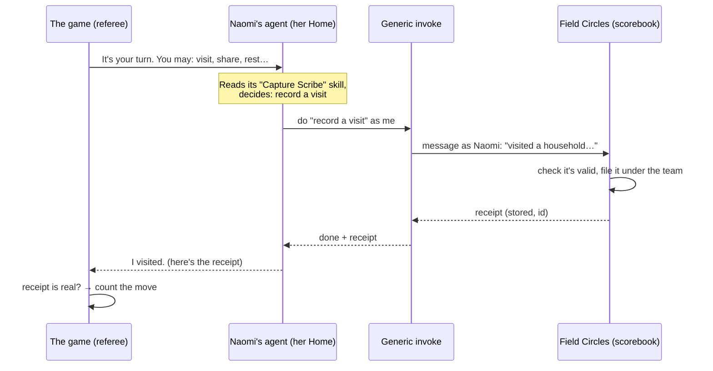
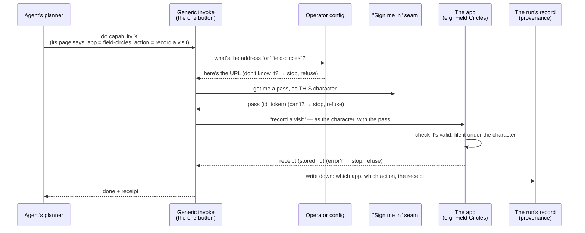
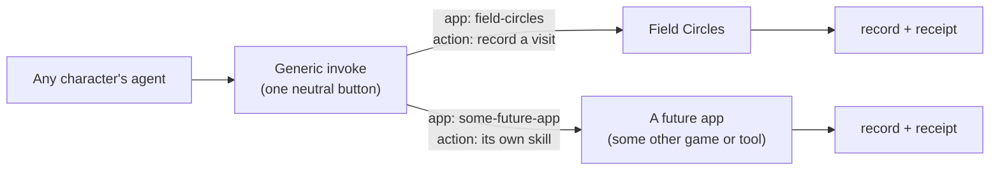
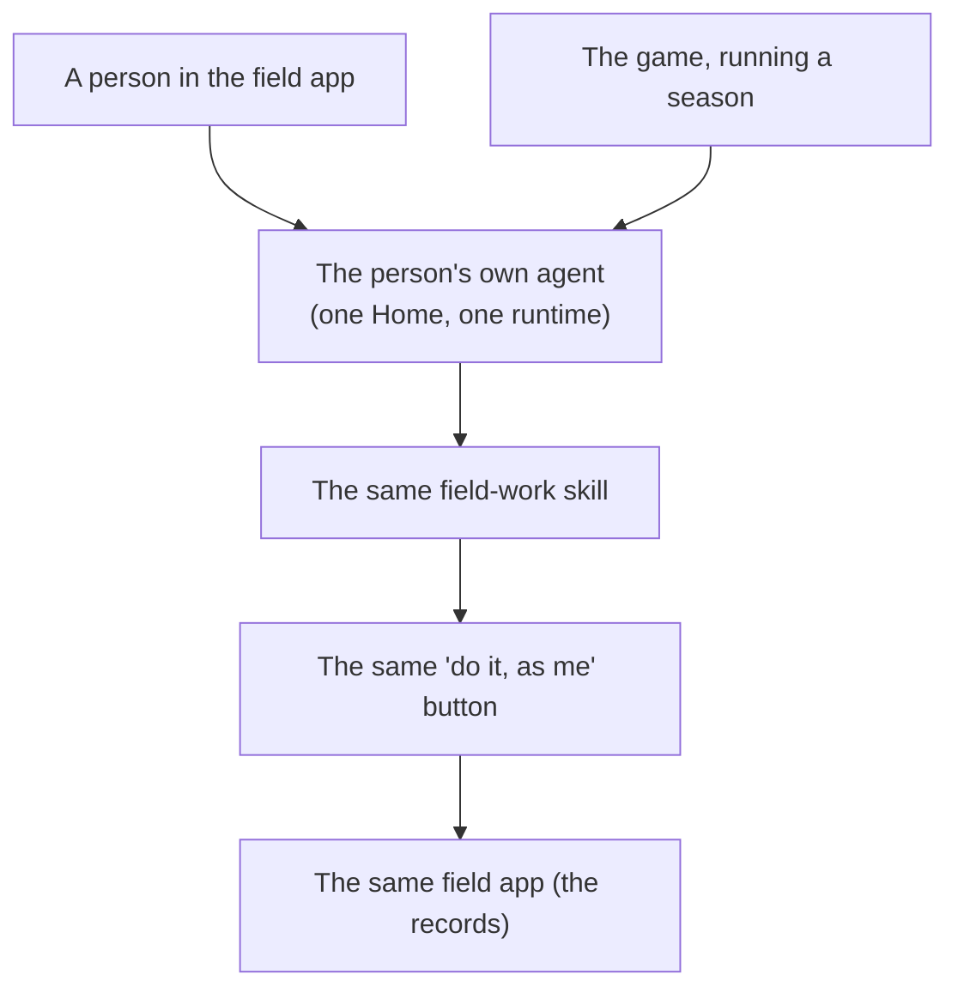

# How field work actually happens — the simple picture

A plain-language companion to [FIELD-RAILS.md](FIELD-RAILS.md) (the build spec) and [EXECUTOR-INVOKE.md](EXECUTOR-INVOKE.md) (the one new runtime piece). No code. If you only read one doc about Field Operations' "rails," read this one first.

---

## The one idea

**The game never does the real work. It asks each character's own AI agent to do it — and only believes a move happened if there's a receipt.**

That's the whole thing. Everything below is just that sentence, slowed down.

---

## An analogy

Think of a sport with:

- a **referee**, who knows the rules and keeps the score,
- **players**, each with their own **coach** who actually makes their moves,
- and an official **scorebook** kept by a neutral scorekeeper.

The referee never grabs the ball and plays for a player. The referee says *"it's your turn — here's what you're allowed to do,"* the player's coach makes the move in the real world, the scorekeeper writes it in the book, and **only then** does the referee update the score — because the move is in the book.

In our game:

| In the analogy | In the system |
|---|---|
| Referee + scorebook rules | **The game engine** (hidden readiness, the dice/seed, whose turn, the score) |
| The player | A **character** in the season (Naomi, a field worker) |
| The player's coach | The character's **own AI agent, at its own Home** |
| The scorebook | **Field Circles** — the real app where field records live |
| "It's in the book" | A **receipt** — proof the record was written |

---

## The cast of parts

- **The game (pokernight).** Runs the season: the clock, whose turn, the rules of what each character *may* do today, the score. It holds no real records and does no real writing. It is the referee.

- **The agent (at its Home).** When it's Naomi's turn, the game messages *`naomi-elena.me`* — a **real AI agent** with its own Home, its own vault, and real skills attached to it. It decides what to do and actually does it. It is the coach. (See the box below: "Naomi" is a real agent, not a puppet.)

- **The skill.** A short set of instructions the agent carries (e.g. "Capture Scribe": how to turn a day's work into a tidy record). The skill is the *playbook page*; it doesn't do anything by itself.

- **The generic invoke.** The universal "now go do it for real" button inside the agent's Home runtime. It's deliberately **plain**: it knows how to call *some other app* and say *"do this, as me,"* without knowing anything about field work. (This is the only new piece we're asking the platform team to build, and it helps every future game/app, not just this one.)

- **Field Circles (the executor).** The real field app — the scorebook. It checks the record is valid and files it under the right team, stamped with Naomi's name.

- **The receipt.** What Field Circles hands back: "stored, here's the id." Proof.

> ### "Naomi" is a real agent, not a puppet
>
> This is the part worth getting straight. `naomi-elena.me` is a **real smart agent** — its own Home, its own vault, real skills attached to it by the archetype it was assigned. It isn't controlled by the game; it decides and acts for itself. "A character named Naomi in a season" is just a **role the game casts it in** — a label and a score the game keeps. The agent never knows it's "in a game," and neither does its Home or the field app: they see a real agent doing real work.
>
> So **"character" is not an architecture concept** — it lives only in pokernight (the referee and its content). The agent-side is simply: *a real agent, with real skills, doing real work as itself.* The only thing that makes this a demo rather than a live field is the estate it runs in (fake people, everything marked "(game)") — not anything about how the agent works. The field-work skills it carries are real; a real field worker's agent would hold the same ones.

---

## One day, start to finish

Naomi is a field worker. It's her turn, and she *may* visit a household today.

1. **The game asks.** It messages Naomi's agent: *"It's your turn. Here's what you may do today."*
2. **The agent decides.** Using its skill, it chooses a legal move — record a visit.
3. **The agent does it for real.** It presses the generic "do it, as me" button, which calls Field Circles **as Naomi** and files the visit.
4. **Field Circles files it** under Naomi's team, with her name on it, and returns a **receipt**.
5. **The agent reports back** to the game with the move *and* the receipt.
6. **The game checks the receipt** and only *then* counts the move. No receipt → the move didn't happen, as far as the game is concerned.

If you now open the real field app, the visit is **there** — written by Naomi's agent, not typed in by the game.

---

## Executor invoke, up close

Step 3 above — *"the agent does it for real"* — is the one new piece. It's called the **executor invoke**, and the point of it is to be **boring and universal**: a single "do this, as me, over there" button that works for *any* app, because it knows nothing about the app.

Here's what actually happens inside that one step:

Three things to notice:

- **The button never knows what "record a visit" means.** It reads the app name and the action off the skill's own page, looks the address up in config, gets a pass for the character, and forwards the request. The *meaning* lives in the app, not the button.
- **Every step can say no.** Unknown app, no pass, or the app rejects it → the whole thing refuses. It never pretends it worked.
- **It leaves a trail.** The run's record notes which app and action ran and the receipt — which is exactly what the game reads back to decide whether to count the move.

### Why "generic" is the whole point

Because the button is empty of any app's details, the **same** button serves the next app too — no new platform code:

A new app plugs in with two lines of config (its address + which login it accepts) and a skill that names it. That's the difference between *this* and the old way, where each app needed its own hand-written copy baked into the platform. Keeping the button generic is how the game stays out of the platform — the thing you asked for.

## The golden rule

> **Apply a move only if there's proof.**

"Proof" is two things together: the agent's Home says *which real action it performed* (not just "I decided to"), **and** the scorebook handed back a receipt. A move the agent only *talked about* doesn't count. A move with no receipt doesn't count.

This is what makes it honest. Before this, the game would just believe whatever the agent said and move the score — the board moved but the real field app stayed empty. The rule closes that gap: **if the board moved, the record exists.**

(Safety valve: if a character's agent keeps failing to do the real thing, after a few tries the game lets "the house" write the record on the character's behalf, and clearly marks it as the house doing it — so a stuck agent doesn't freeze the season, and nobody is fooled into thinking the agent did it.)

---

## The field app and the game take the same road

Here's the part that makes it all one system instead of two. When a **real person** uses the field app and records a visit, and when the **game** runs a season and Naomi records a visit, *both go the same way*: they ask the person's own agent (at the same Home/runtime), that agent runs the **same** field-work skill, and the work lands in the **same** field app through the same "do it, as me" button.

Two consequences you'll feel:

- **A record a person makes and a record the game makes are made by the exact same logic.** Improve how a visit is captured once, and both improve. There's no "the game does it one way, the app does it another."
- **It's tested once.** Because they're the same skills, the field app's own test suite is what proves them. The game doesn't re-test field work — its tests only cover the game parts (the rules, the turn, the "only count it with a receipt" check).

Two things keep it honest, so the app can still feel snappy: **judgment** (what to record, how to shape it, whether it's even allowed) always runs through the one skill; and **every** write — fast form or agent — is checked by the same field app (the same validation). A quick form is fine; a *second, different* way of shaping records hiding in the browser is not.

## Who owns what (and why the boundary matters)

Four separate parts of the world, on purpose:

- **The game** owns the *rules and the score*. (pokernight)
- **Each character's Home** owns *doing the work as that character*. (the platform runtime)
- **Field Circles** owns *the real records*. (the field app)
- **The skills** own *how an agent decides and what it declares it will call*. (the skills library)

The important discipline: **the game does not leak into the platform.** The platform's new "do it, as me" button is kept *generic* — it has no idea what "field work" is. It just calls a named app and says "do this." That way the platform stays clean and reusable, the game stays a game, and the real records stay in the real app. (If the game's vocabulary had been baked into the platform, every future game would inherit this one's mess.)

---

## What's real vs. what's a demo shortcut

This runs in a **demo estate** (fake people, a practice field, everything marked "(game)"). A few corners are cut and said out loud in the code:

- **Signing in as a character** uses a demo convenience instead of a real device approval.
- **The field app, the teams, the names** are all a game's — marked as such, never a real field.
- **The hidden "how ready a community is"** is the game's dice; Field Circles never writes that — it only records *what happened*, never *what it means*.

Everything else — an agent really running at a real Home, really calling the field app as the character, a real receipt, the game checking it — is the real thing. That's the point of the exercise: to prove the substrate can carry real agents doing real, verifiable work.

---

## If you remember three sentences

1. The game asks each character's **own agent** to act; it never acts for them.
2. The agent does the work **for real** in the field app, as the character, and gets a **receipt**.
3. The game counts the move **only with the receipt** — so the board and the real records can never disagree.
