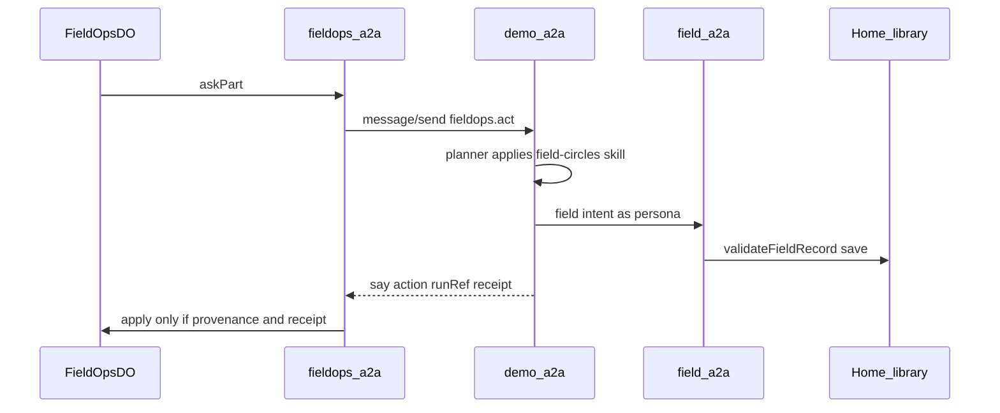

# Field Rails — design for the builder

**Status:** specified 2026-10-03. Not built. Companion to [FIELD-OPERATIONS.md](FIELD-OPERATIONS.md) (the game) and the Field Circles app (`~/engage`, field.faithnet.io). The one runtime piece this needs is the neutral [EXECUTOR-INVOKE.md](EXECUTOR-INVOKE.md) primitive — build that, not a fieldops module. For the plain-language picture of the whole behaviour, see [FIELD-RAILS-EXPLAINED.md](FIELD-RAILS-EXPLAINED.md).

**What to ship.** A season day is applied only when the **character’s own agent**, at **demo-a2a**, **selects and runs** skills from the **field-circles** domain. Those skills invoke Field Circles / Home the way a person at field.faithnet.io does. A tester at Home sees which skills ran; at the field app they see the work. The Worker must not dump the game log into `/connect/library` and call that the rails.

This document is enough to build from. Do not invent a second write path.

---

## 0 · The rule

The engine owns the **game**: hidden readiness, the seed, `may`, energy, weather, derived phase, the score, the clock.

demo-a2a + field-circles skills + Field Circles / Home own the **record**.

```
apply(engine)  iff  run.provenance names the expected skill as applied
               and  Field Circles / Home accepted the write (receipt)
```

A JSON-only `{ "action": "visit" }` with no applied skill is **today’s path** and is a **miss**.

House fallback after three misses may write Field Circles **as the persona**. Count it as house, not as a skill the agent applied.

---

## 1 · What exists today (do not extend this)

| Layer | File | What it does |
|---|---|---|
| Client | [apps/tables/src/fieldops-a2a.ts](../apps/tables/src/fieldops-a2a.ts) | House-signed `message/send`. Checks card has `fieldops.act`. Parses `{say,action}`. **Does not apply skills.** |
| Runtime | `~/agenticprimitives/apps/demo-a2a` | Persona harness. Planner applies **playbook** tools. Writes `run.provenance` + task `trace`. |
| Craft | `~/skills/skills/fieldops/*` | Instruction skills (`fieldops-work`, …). Scope `{ game: fieldops }`. Model returns JSON. **Nothing is performed.** |
| Archetypes | `north-*` in context `field-operations` | Attach those craft skills + `fieldops.act`. [scripts/register-fieldops.mjs](../../skills/scripts/register-fieldops.mjs) |
| Season | [apps/tables/src/fieldops-do.ts](../apps/tables/src/fieldops-do.ts) `askOne` | `applied` = engine accepted the JSON. |
| Dump | [apps/tables/src/field-estate.ts](../apps/tables/src/field-estate.ts) `writeSeason` | Custodian `demo-signin` → `POST /connect/library` `save-batch`. **Retire as the live path.** |
| Charter | [apps/tables/src/field-charter.ts](../apps/tables/src/field-charter.ts) | Composed deploy/vault/grants. Membership + `carryTalk` already use Home — **keep those.** |
| Field doctrine | `~/skills/skills/field-circles/*` | Name `field.*` intents. Mostly `archetype: true`. **Not executable tools yet.** |
| Executor | `~/engage/apps/field-a2a` | Browser/`sendFieldIntent` → `validateFieldRecord` → Home library. Card in `agent-card.ts`. |



---

## 2 · One skill set, one execution path, tested once

The actor is always a **real agent acting as itself** (`naomi-elena.me` is a real smart agent, not a "character" — see [FIELD-RAILS-EXPLAINED.md](FIELD-RAILS-EXPLAINED.md)). There is exactly **one** set of field-work skills, **one** runtime that runs them, and **one** executor that records the work. The field app and the game are just two *callers* of that one path.

### 2.1 One skill set

**`field-circles` is the domain's agent skills — the single source of truth.** They live in `~/skills/skills/field-circles/*`, their role→performer map is `~/skills/scripts/field-circles-set.mjs`, and BOTH registers consume that one file:

- `register-field-circles.mjs` → a **`field-worker` archetype** (+ role variants: worker, coach, steward, coordinator, partner) for a REAL field worker's agent.
- `register-fieldops.mjs` → the game's `fieldops-character` / `north-*`, which take the **same** performers from the set and add **only the seat** (`fieldops-inhabit` + the `fieldops.act` capability — "you are playing a part, choose from `may`").

The game never copies, forks or re-tests the field skills. Do **not** grow a parallel `fieldops.records-save`.

| Archetype | field-circles performers | seat (`fieldops-inhabit` / `fieldops.act`) |
|---|---|---|
| `field-worker` (real agent, field app) | yes (from the set) | **no** |
| `north-*` / `fieldops-character` (game) | yes (**same** set) | yes |

### 2.2 One execution path

A question or an action — **from the field app OR from the game** — goes the same way:

```
caller (field app UI  |  game season)
   → the person's own agent at demo-a2a        ← same runtime
   → the same field-circles skill artifact      ← same decision/shaping logic
   → the generic executor-invoke (EXECUTOR-INVOKE.md)
   → field-a2a (the executor)                    ← same records
```

Convergence is held by **two shared enforcement points**, so there is never a divergent second implementation:

1. **The skill (for judgment).** Anything that requires a decision — what to record, which instrument, how to shape the envelope, whether a thing is even a valid move — routes through the **person's agent** at demo-a2a running the **one** `field-circles` skill. This is identical for the field app and the game; Field's "Ask" already works this way, and judgment-bearing "do" joins it.
2. **The executor (for validation).** **Every** write — whether it came through the agent or straight from a plain form — crosses the **same** executor (field-a2a `validateFieldRecord`). The executor is the floor: a record that would diverge is refused there, for both callers alike.

So a plain, unambiguous form **may** still write fast (no LLM step) for snappy UX — but it writes through that same executor, under the same rules, as the agent's own invoke. What is **not** allowed is a *second shaping/authority logic* living in the browser: the record a person makes and the record the game makes are shaped by the same skill and validated by the same executor, and a change to either changes both at once. (Field's current browser `sendFieldIntent` is the fast lane into the executor; it keeps that lane, but it owns no shaping the skill doesn't.)

### 2.3 Tested once

Because the field app and the game run the **same** artifacts, those artifacts are tested **once**, in the field domain's harness, at two layers:

- **Skill selection / behaviour** — `~/skills/evaluations/field-circles/` (the `skill-evals` replay harness, authored as `capture.src.json`, built to replay/gold/fixtures/outcome-gold). It runs asks against the **`field-worker` archetype** (the real-agent shape — same field-circles skills, no seat) and scores whether a "what happened in the field" ask routes to `field.records-save` and whether an off-domain ask fires nothing. Built from the one `field-circles` skill set, so it tests exactly what the game runs.
- **Executor / integration** — `~/engage/tests/live/field-*.spec.ts`: a real agent runs the skill and the executor holds the record.

The game's own tests cover only what is game-specific — the engine, the seat, and the apply-iff-proof gate — and never re-test the field skills.

Re-publish and re-assign after an attach. A card that has only `fieldops.act` + inhabit (the seat, no performer) **fails** a real action (`unknown_tool`) — which is the point: the seat is not the work.

---

## 3 · Skills to create or update

Work in `~/skills`. Register/publish through the existing skills A2A. Each **performer** skill must be a harness tool (capability id = the `field.*` intent, or a named tool that invokes it). Doctrine-only `archetype: true` with no execution is not enough.

### 3.1 Update (exist under `skills/field-circles/`)

| Skill | Make it | Intent | Season verbs |
|---|---|---|---|
| `field-capture-scribe` | Executable. Turns the day’s act into an `activity` / `observation` and **submits** `field.records-save`. | `field.records-save` | `visit` `share` `study` `gather` `baptize` `train` `report` `support` |
| `field-formation-coach` | Executable coaching / prayer write | `field.records-save` (coaching), `field.prayer-recorded` | `coach` |
| `field-progress-synthesist` | Stay **propose only** (real-domain rule) | drafts for `field.phase-asserted` | Priya reads evidence |
| `field-work-orchestrator` | Executable. After onboard, a local plan / work items exist | `field.records-save` `work-item` / `local-plan` | follows `define-community` |
| `field-discussion-host` | Executable board post if not already Home `general` | team conversation / `field.discussion-post` | `say` (prefer existing `postLine` if it already is the field app’s `general`) |

### 3.2 Create

| Skill | Intent / ceremony | Season verbs |
|---|---|---|
| `field-phase-assert` | **Submit** `field.phase-asserted` (assessment + result pair). Principal only. Simulated, about the **game copy**. Never `gmo:community-phase`. | `assess` |
| `field-community-onboard` | `field.community-onboard` | `define-community` |
| `field-team-founder` | Home `org-create` purpose `field-team`, then `field.workspace-team-associate`, `field.team-profile-set` | `found-team` |
| `field-body-founder` | `org-create` `field-circle` / `field-church`, `field.body-profile-set`, `field.body-community-set`, `field.workspace-body-associate` | `found` `recognize` |
| `field-community-adopt` | `field.workspace-community-associate` | `adopt` |
| `field-roster` | `field.team-member-add` / `field.team-join-confirm` (Home join already in `field-charter.ts` `admit` — skill must use that, not a fake roster row) | `invite` `join` |

### 3.3 Narrow the game craft (`skills/fieldops/`)

| Skill | Keep as | Stop doing |
|---|---|---|
| `fieldops-inhabit` | Seat: first person, game mark, one line | Performing writes |
| `fieldops-work` | Ladder: what `you.may` means; **cite** capture-scribe / founder | “Return JSON and you are done” |
| `fieldops-steward` / `fieldops-partner` / `fieldops-consult` | Doctrine pointing at field-circles performers | Acting as the write |
| `director-craft` | Week narration | — |

### 3.4 `north-*` attach

| Kind | Attach |
|---|---|
| worker (Naomi, Yusuf, Farid, Grace, Tomás, Olena, Hodan, Luis) | inhabit + work (ladder) + **capture-scribe** + body-founder |
| coach (Carla, Mark) | inhabit + capture-scribe + **formation-coach** |
| steward (Priya) | inhabit + synthesist + **phase-assert** + community-onboard + adopt + work-orchestrator |
| coordinator (Sam) | inhabit + capture-scribe + adopt (moves people; may found) |
| partner (Dan, Kim, Jenna, Walt) | inhabit + capture-scribe (support as activity) |
| founder of a team (first member of `you.intended`) | **team-founder** + roster |
| all who speak | discussion-host only if `say` is not already `carryTalk` |

Capabilities on the game card stay `fieldops.act` | `consult` | messaging. **Tools** on the compiled playbook must include the field-circles performers.

---

## 4 · Verb → skill → who

Same goals the browser sends ([Capture.tsx](../../engage/apps/field-web/src/Capture.tsx) `sendFieldIntent`). Same `validateFieldRecord`. No hand-built JSON into `/connect/library`.

| Season verb | Skill applied on the persona | Then |
|---|---|---|
| `found-team` | `field-team-founder` | Engine records the team; charter id = org Home returned |
| `invite` / `join` / `decline` | `field-roster` + existing Home `admit` | Roster row is a projection of standing |
| `adopt` | `field-community-adopt` | Workspace `ws-community`. Associate may need **Nathan** (workspace steward) — that is the field app’s gate, not a dodge. Founder requests; steward session completes if required. |
| `define-community` | `field-community-onboard` | Local plan via work-orchestrator |
| `visit` `share` `study` `gather` `baptize` `train` `support` `report` | `field-capture-scribe` | `activity` / `observation`; `recordedBy` = persona SA; purpose marked game |
| `coach` | `field-formation-coach` | — |
| `found` / `recognize` | `field-body-founder` | Body agent + associate |
| `assess` | `field-phase-assert` | Pair in workspace vault |
| `say` | existing `carryTalk` / discussion-host | Team `general` |
| `whisper` | existing `messaging.send` | — |
| `move` `rest` weather | engine only | No field write |

`recordedBy` is the **persona** (`naomi-elena.me`), never Elena, never the house session key.

---

## 5 · The A2A ask

Keep `fieldops.act` as the season’s skill id ([packages/protocol/src/index.ts](../packages/protocol/src/index.ts) `encodeFieldOpsParts`). Change the **shape**:

1. Still send `view`, `may`, craft, brief.
2. **Add** the performer: skill id, org (team SA), record/intent draft that would land this legal move.
3. Require the reply to include:
   - `say` (one line)
   - `action` (engine verb, from `may`)
   - `runRef` (Home run)
   - `receipt` (`storedIn` / record id / association id / org address)

`fieldops-a2a.ts` stays a **client**. It does not call Field Circles. Decoding must fail closed if `runRef` or `receipt` is missing.

### Apply gate (`FieldOpsDO.askOne`)

Before `apply`:

1. Parse action; must be in `may`.
2. Load `run.provenance:<runRef>` at the persona’s Home (spec 414) **or** read the task `trace` / `run-provenance/v1` on the A2A result. Fail unless the expected field-circles skill id is **applied** (a tool step, not planner prose).
3. Confirm the receipt (field-a2a `field.records-list` or Home library as the persona). Fail if the vault does not hold it.
4. Then `apply`. Map charter results (`found-team`, `found`) from the receipt’s agent address — do not deploy in the Worker if the skill already created the org.

`AgentStats` today:

```ts
{ asked, answered, applied, refused, unparsed, missed, ms, rested, byRules, empty? }
```

Add per-skill: `skills: Record<id, { selected, applied, refused }>` and `houseTaken`. The page must show **which skills ran**.

Empty answer (402 / no say / no action) stays a miss. Three misses → house writes the **same** Field intent as the persona; `houseTaken++`; `applied` on the engine only after that write lands.

---

## 6 · Principal and session

Every field write is the character.

```
POST /connect/demo-signin
{ handle: "<custodian>", as: "<personaSa>", client_id: "field-app" }
```

Already in `sessionOf` / `personaSession` in `field-charter.ts`. Field Circles must admit that id_token the way the browser does (`~/engage/apps/field-web/src/intents.ts` `sendFieldIntent`).

The persona’s playbook tool presents that session (or the harness already has it). The Worker must not mint the session and call field-a2a itself on a live agent day.

Estate note (`fieldops-estate`) gains `fieldA2a` (Field Circles Worker URL). Today it only has Home `a2a.faithnet.io`.

---

## 7 · Charter / org-create

**Rule:** a team, circle, or church exists only as Home `org-create` with purpose `field-team` | `field-circle` | `field-church`, signed as the founding character (demo: custodian `persona-sign`).

**Today:** `field-charter.ts` `deploy` / `bindVault` / `enableStorage` is the seed-script stand-in. **Forbidden** for activities, associations, and readings.

**Upstream (Home, `~/agenticprimitives`):** a non-browser completion of the same batch the field app popup runs ([NewTeamDrawer.tsx](../../engage/apps/field-web/src/NewTeamDrawer.tsx) → `createOrganizationViaHome`). Until that door exists, composed deploy is a **named remaining shortcut** for **create only**, and `field-team-founder` must still: associate + profile + playbook seed via Field Circles (`workspace_team_associate` already opens `general`).

Prefer Field Circles associate over the season opening the channel itself.

Keep `join` / `stewardOf` / `admit` / `carryTalk` as they are (Home ceremonies).

---

## 8 · What to retire

- `writeSeason` `save-batch` as the **live** path. Keep the function only as a labeled **repair/backfill** (operator “write it out now” after a failed skill), never as the success path.
- Daily `writeEstate(false)` on day tick as the way the field app “follows.” The field app follows because the **agent already wrote**.
- Game page copy that treats `written N records` as proof. Proof is provenance + vault.

`publishSeasonGraph` (SPARQL at reveal) stays a **side** publish, not the field app.

---

## 9 · What you must see

### Home (as the character)

- Task / `run.provenance` for the day — skill ids applied
- Related orgs / trust graph (org → teams → bodies)
- Directory listings, membership records
- Team `general`, inbox
- Playbook on a new team/body
- Team org library: the activity, not `fo-<tag>-act-N`

### field.faithnet.io (same persona, workspace Northern Colorado Field — Game Night)

- Teams, circles, churches
- Recent activity (Field Circles titles)
- Defined communities + local plan
- Phase pair after assess
- Board and DMs

If the board moved and the vault is empty, the build is wrong.

---

## 10 · Build order

Do these in order. Each step has a proof. Do not start 4 before 1–3 pass.

**1. Skills corpus (`~/skills`).** Update/create the table in §3. Register/publish field-circles. Re-attach `north-*`. Re-assign the sixteen personas (`CONTEXT=field-operations`). Prove: Naomi’s card lists `field-capture-scribe` / `field.records-save` as a tool.

**2. Harness can apply it.** One signed `message/send` as the house to `naomi-elena.me` with a visit-shaped payload. Prove: `run.provenance` names the capture skill; field-a2a or library holds the record. Negative: strip the skill from a copy of the playbook → `unknown_tool`, engine does not apply.

**3. Apply gate in `FieldOpsDO`.** Wire `runRef` + receipt into decode + `askOne`. Prove: a season visit without provenance does not increment `applied`.

**4. Found / onboard / assess** through the new skills. Charter uses org-create or the named shortcut + Field Circles associate.

**5. Walk.** Extend `pnpm walk:fieldops`: after a founded team and two visits, as Naomi, `field.records-list` + Home provenance. Fail if the engine applied an act the vault does not hold, or provenance is empty.

**6. Kill live `writeSeason`.** Repair-only.

---

## 11 · Files a builder will touch

| Area | Files |
|---|---|
| This spec | `docs/FIELD-RAILS.md` |
| Game rules pointer | `docs/FIELD-OPERATIONS.md` §5–§6 |
| Ask shape | `packages/protocol/src/index.ts` (`encodeFieldOpsParts`, decode) |
| Client | `apps/tables/src/fieldops-a2a.ts` |
| Gate / stats | `apps/tables/src/fieldops-do.ts` |
| Estate note | `field-estate.ts` parse + `fieldA2a`; stop live dump |
| **Generic invoke (REQUIRED, AP)** | **`~/agenticprimitives/apps/demo-a2a` — a NEUTRAL generic executor-invoke (or a Field Circles connector), see §11a. The gate; without it a `field.*` capability is inert. NO fieldops/Field Circles module, no season verbs.** |
| Skills | `~/skills/skills/field-circles/*`, `~/skills/skills/fieldops/*`, `~/skills/archetypes/north-*`, `register-fieldops.mjs` or a field-circles register |
| Capability profile | `~/skills/packages/archetype-compiler/src/capability-profile.ts` (a row per `field.*`, or it compiles "unprofiled/informational") |
| Assign | `assign-org-archetype.mts` (existing) |
| Field executor | `~/engage/apps/field-a2a` only if a skill needs a new intent (prefer existing card ids) |
| Home org-create door | `~/agenticprimitives` (upstream; can lag create) |
| Walk | `scripts` / `pnpm walk:fieldops` |

`packages/*` still hardcode no domains. Field Circles URL lives in the estate note / `apps/*`.

### 11a · The harness gap — and why the fix is a GENERIC primitive, not a fieldops module

**NO FIELDOPS / FIELD CIRCLES CODE IN `~/agenticprimitives`.** A persona runs at demo-a2a, so the *mechanism* that performs a write lives there — but a Field Circles client, a `field.records-save` ToolSpec, or any season verb in demo-a2a is this game bleeding into the substrate, and it does not go there. (A first draft of this spec stuffed a `field-tools.ts` into demo-a2a; it was deleted. Do not re-add it, and never add `found-team` / season verbs there.)

**The real gap** is in the harness, not in product placement: the planner's act-tools are a fixed hand-written array (`HARNESS_ACTION_TOOLS`, `harness-run.ts`) narrowed by the playbook's capability ids, and invocation is a hand-written dispatch in `harnessInvoker`. There is **no generic "a capability declares its executor and the harness `message/send`s there as the principal"** path — `external.agent.ask` / `engagement.agent.invoke` are read-only and cannot carry `metadata.skill`. That absence is the thing to fix, as a NEUTRAL capability of the runtime that any domain uses.

**Three acceptable shapes (demand one; all keep this game out of AP):**

1. **Generic write-invoke in the harness (preferred).** A capability's contract declares `{ invoke: { transport: 'a2a.message-send', executor: <ref>, intent: <skill id> }, selfAuthorized }`; ONE generic invoker in the harness reads that, resolves `<executor>` to a URL via operator config, and `message/send`s there as the run's principal with `metadata.skill = intent`, returning the result as the receipt. No `field-tools.ts`, no per-capability branch — `field.records-save` and every later performer route through it by declaration alone. **Full spec: [EXECUTOR-INVOKE.md](EXECUTOR-INVOKE.md).**
2. **Field Circles as a connector (acceptable).** Register the executor like the GitHub connector — operator config and a generic connector-invoke, not a domain module. The capability names the connector; the URL and session are the connector's config.
3. **A neutral per-executor adapter, only if (1)/(2) lag.** If a bespoke adapter is unavoidable short-term, it is a *Field Circles executor* adapter (one A2A `message/send` client, game-unaware — no season verbs, no `fieldops` names), configured by URL, exactly as it would be for any caller. Still not game code.

**The session seam (any shape):** the invoker needs a `field-app` id_token for THIS character. Demo estate: `demo-signin { client_id:'field-app', handle:<custodian>, as:<persona> }` (§12 shortcut; the persona→custodian map is the one in `field-charter.ts`). That seam is the only genuinely new runtime concern.

**What stays out of AP, by tree:** the executor is `~/engage/apps/field-a2a` (already there); the season verbs, the ask shape and the apply gate are `~/pokernight`; the skills, archetypes and the capability's executor declaration are `~/skills`. The `<executor>` reference the capability names resolves to the field-a2a URL through AP *operator config / a connector registry*, never a domain module and never a hardcoded host.

**Pokernight must NOT call field-a2a itself** — the house writing as the character is the "dump" §0 rejects. The write is the persona's own run, at the persona's own Home.

---

## 12 · Remaining shortcuts (say them in code comments)

- Demo `demo-signin` / `persona-sign` instead of a device approval
- Game workspace, names `(game)`, `fo:isGame`, simulated envelopes
- Engine still draws hidden outcomes; Field Circles never writes readiness
- Workspace associates may complete as Nathan
- Composed `org-create` until Home ships the agent door
- Graph SPARQL at reveal

---

## 13 · Acceptance (hand to QA)

1. Naomi’s agent card lists field-circles capture (or `field.records-save`) as a tool.
2. Live A2A visit: provenance names that skill; team vault has the activity; `recordedBy` is Naomi’s SA.
3. Season `applied` did not increment before (2).
4. Agent without the skill: miss; house may write as Naomi; `houseTaken`; field app still shows the activity.
5. Home as Naomi: run visible; org in the graph.
6. field.faithnet.io as Naomi: activity on the team, not a Worker batch id.
7. `pnpm walk:fieldops` fails if (2) or (5) is false.

---

## 14 · Out of scope

- Changing hidden readiness, `phaseOf`, or scoring
- Assessing real registry communities
- Making the field app the game clock
- Rewriting Hold’em / Canasta / Mystery / Commission
- Deleting composed charter before the Home org-create door exists (name it; do not use it for records)
