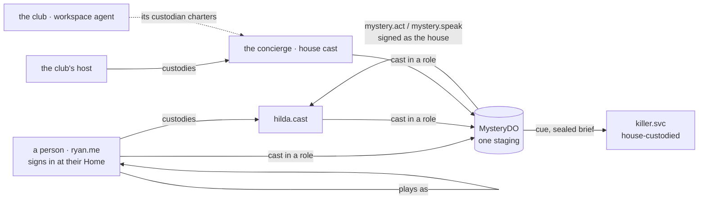

# Mystery Night — a story at a place, played by custodied characters

**Status:** specification, 2026-09-15. Nothing built yet. The third game, and the first one that is not a
table: it happens at a **place**, it is played by **characters** each of which is a real Smart Agent somebody
custodies, and its rules are a **title** — content, not a package. Companion specs: `docs/SPATIAL-ROOM.md`
(the room, the bodies, the cues this uses), `docs/GAMES.md` (why a port exists and what it is for),
`docs/MISSION-REGISTRY.md` (the admission pipeline this copies), `docs/WORKSPACES.md` §5 (a club is its
agent — so is a character).

The first title is **Snowfall at the Belvedere** — a ski resort in the Alps, five rooms, eight roles, three
acts, two deaths.

## 0. What this decides (read first)

1. **A PLACE HOSTS A STORY; it does not know which** — the same sentence the table lives under. `MysteryDO`
   holds a staging's state as `unknown`, asks the engine for everything it needs, and never reads a field.
   The Durable Object is new because a place is not a table: there are no seats, no turn queue, no stakes.
2. **ONE ENGINE, MANY TITLES.** Hold'em and canasta needed two packages because they share no rules. Two
   mysteries share ALL of them — rooms, acts, clues, testimony, accusation, a reveal — and differ only in
   content. So `packages/mystery` is written once and a title is **data**: a cast of roles, a map of the
   venue's rooms, a clue graph, an act plan, and a set of skill artifacts. Adding a mystery is authoring a
   title, not writing code. The day a title needs a rule the engine does not have, it earns the rule — not
   a package.
3. **VENUE · TITLE · STAGING are three different things.** The **venue** is a place (the Belvedere: rooms,
   anchors, props, scenery) and many mysteries run in it. The **title** is the script. The **staging** is one
   run of a title at a venue for one night, with one real cast. They are versioned and owned separately, and
   a staging pins all three at curtain-up and never re-reads them — the table's pinning rule, again.
4. **EVERY CHARACTER IS A CUSTODIED AGENT.** Not a row, not an NPC record: a Smart Agent with a name, a card,
   a vault and a **custodian** who is answerable for it. A player brings the agent they already are
   (`ryan.me`) and may charter others (`hilda.cast`), and the club's host may charter the rest. A character
   agent is `.cast` — a VERTICAL agent type (`packages/agent-naming` `registerVerticalAgentTypes`, spec 346
   §2.4) whose generic derived type is `person`: person-shaped, so it can speak and remember, and never
   mistakable for a human, because the suffix says what it is and every screen names its custodian.
5. **A ROLE IS AN ARCHETYPE; A CHARACTER IS THAT ARCHETYPE, CAST.** The skills estate gains a `mystery`
   context beside `texas-holdem` and `canasta` — one ontology, a dozen skill artifacts, and MANY archetypes:
   one per role of every title, plus the craft archetypes (`mystery-character`, `mystery-director`,
   `mystery-killer`). Casting an agent in a role pins that role's compiled archetype onto it, which is the
   road `assign-person-archetype.mts` already walks for a coach.
6. **THE ENGINE OWNS FACTS; THE MODEL OWNS WORDS.** Who the killer is, where a clue is, whether a murder was
   possible, whether an accusation is right — the engine, deterministically, from a seed. The director
   service writes the connective prose around facts it is handed, and can no more invent a clue than the
   coach can invent a card. This is the same line `docs/HOLDEM-COACH.md` draws: the move is the engine's, the
   reading is the model's. It is what makes an LLM-narrated mystery solvable.
7. **THE KILLER IS DRAWN BY THE SEED, COMMITTED BEFORE THE NIGHT, AND REVEALED AFTER.** `sha256(seed)` is
   published when the staging opens; the cast order and the killer come out of `@pokernight/deal`'s seeded
   shuffle; at the reveal the seed is published and anybody can recompute it. The card room's one fairness
   claim, applied to a whodunnit: **nobody, including the house, chose the killer after the game began.**
8. **FACTS ARE THE ENGINE'S; CLAIMS ARE THE PLAYERS'.** Lying is the game. Testimony, alibis and accusations
   are recorded as CLAIMS with a speaker and a time, never as truth, and nothing in the system — least of all
   the director — may promote a claim to a fact.
9. **A CLUE IS A CARD.** Private knowledge lives behind `viewFor(state, character)` and leaves the object
   only to the character who holds it. An implementation that broadcasts the state and hides it in the client
   has not implemented this, exactly as with hole cards.
10. **IT IS PLAYABLE WITHOUT WEBGL.** The 2D place page — who is here, what was said, your character sheet,
    your clue book, the act clock, your moves — is the primary client and ships first. The 3D venue is a
    second presentation of the same staging, as the room is a second board for the same table.
11. **ONE PLAYER AND SEVEN AGENTS IS THE DEFAULT SHAPE, not a degraded one.** A staging runs with a single
    human and the rest of the cast played by the estate's own agents — the demo people the card room already
    signs in and seats (`alice.me`, `bob.me`, `carol.me`, `dave.me`, `elena.me`, …) — drawn as the same bodies,
    in the same rooms, with the same walking, sitting and placed voice the poker room uses. Nothing in the
    design distinguishes "solo" from "eight friends" except how many of the cast have a person behind them, so
    the solo night is also how the whole thing is tested every day.
12. **NO MONEY, EVER.** A staging is `staked: false` by construction: no buy-in, no ledger row, no treasury on
    a `.cast` agent, and a cast agent may not be seated at a staked table. A mystery that ever moves a Sheqel
    has become something this document did not describe.

## 1. The night, end to end

Thursday. Your club's calendar says **Mystery Night — Snowfall at the Belvedere**, and the invitation your
club's agent sent a week ago is in your Home. You open it: eight roles, three of them still free, the night
starting at eight. You play as yourself — `ryan.me` — and take **Dr Halloran**, the resort doctor. Your
partner wants to play too but has no character: one trip to her Home charters `mira.cast`, custodied by her,
and she takes **the journalist**. The host's own agents fill the four roles nobody claimed.

At 7:55 the club house opens. At eight the staging goes **curtain-up**: the seed's commitment is posted, the
cast is drawn, and eight briefs go out — yours says who Halloran is, what he wants, and the one thing he
would rather nobody knew. One of the eight also receives a second, sealed brief. You are not told whether it
was yours to read.

**Act I — Arrival.** The lobby. Everyone is here; the snow has closed the pass. You talk — really talk, your
voice in the room's call, your body by the fire if you came in 3D, your typed lines on the transcript if you
did not. You examine the register and learn who checked in when. Twenty minutes.

**Interlude.** The lights drop. The director reads four sentences: the wind, the generator, and the shape in
the snow outside the ski room. The engine has already decided that the ski room is where the body is, and
which two clues it leaves.

**Act II — The house.** Doors open: lounge, kitchen, guest rooms, ski room. You search, you compare notes,
you lie about where you were at nine. Somewhere in the middle of the act a second death happens — legally,
because the killer found somebody alone in a room the title marks as an opportunity, and the engine wrote the
evidence that act leaves behind. Your character's own agent will prompt you if you ask it to ("what would
Halloran do?"); it will play him for you if you have to step away, and the night does not stop because you
did.

**Act III — Accusations.** Everyone is called back to the lounge. Each character says who they think it was
and which clues say so. Privately, each player submits a final accusation.

**The reveal.** The seed is published. The killer's own account of the night is read out — what they planned,
what nearly caught them. Who was right, who was fooled, and the two clues nobody found. It goes in your
vault as a keepsake if you want it; the voice was never recorded.

## 2. Principles that bound the design

- **The staging is the authority; the venue is a view.** Presence, bodies and voice are `SceneDO`'s, exactly
  as they are for the lounge; a body standing in the kitchen grants nothing. What room a character is IN for
  the story is the staging's own answer to `move`.
- **Nobody is ever asked to trust the house.** Commitment before, seed after, replay from (seed, action log)
  byte-identical. The director's prose is outside the replay; the story's facts are inside it.
- **A model failure must not be a game failure.** Every cue the director writes has a written fallback in the
  title. Director down, budget spent, or slow: the night runs on the title's own lines and says so, the way
  the table falls back to the house coach.
- **Attention is a person's own input.** `ATTENTION_MS` applies: a staging with nobody attending stops
  advancing rather than burning tokens to narrate an empty resort to four agents.
- **Stepping out is supported, not punished.** Your character's agent is its understudy. It plays the role
  from the archetype and your brief; the record says which lines were yours and which were its.
- **Nothing generated is about a real person.** A cast agent plays a character and never impersonates a human
  being, living or dead; the director never writes about a player, only about a character.
- **Degrade, always**: no WebGL → the place page; no microphone → the transcript; no agent of your own → the
  house casts an understudy and you still play.

## 3. Venue · Title · Staging

| | What it is | Where it lives | Who writes it | Pinned when |
| --- | --- | --- | --- | --- |
| **Venue** | A place: rooms, doors between them, anchors, props, scenery | `packages/mystery/venues/<id>.ts` (built-in) → later a manifest in KV + glTF in R2, `VenueManifest` | the house, or a club host with a scene | at staging creation |
| **Title** | A script: roles, act plan, clue graph, murder opportunities, written lines, which archetype each role is | `packages/mystery/titles/<id>.ts` → later a signed content bundle | the house, or an author | at staging creation |
| **Staging** | One run: the cast, the seed commitment, the log, what each character knows | `MysteryDO` (SQLite, one object per staging) | the players | — it IS the run |

A title declares the venue it needs (`venue: 'alpine-belvedere'`) and names rooms and props by the venue's own
names. Creating a staging **checks the title against the venue** — every room, door and prop the title names
must exist — and refuses with the missing names rather than discovering the mismatch in Act II. That check is
the whole reason the two are separate: it is what lets a second title run at the Belvedere, and the Belvedere's
scenery be re-lit, without either touching the other.

### 3.1 The Belvedere (venue `alpine-belvedere`)

Five rooms, because five is enough for a crowd of eight to split, meet, and be alone with somebody:

| Room | Anchors / props | Why it exists |
| --- | --- | --- |
| `lobby` | reception desk, **register**, fireplace, front doors (snowed shut) | Everyone starts here; the act-I room; the register is the first clue surface |
| `lounge` | hearth, bar, piano, **drinks tray**, armchairs (the fireside from the card room's lounge, re-dressed) | Where the group re-forms; the accusation room in act III |
| `kitchen` | range, larder, **knife block**, service stairs | A murder opportunity; the service stairs are how somebody is somewhere they said they were not |
| `guest-room` | bed, writing desk, **suitcase**, balcony | A private room per character (instanced: `guest-room:<character>`), which is where secrets are searched for |
| `ski-room` | racks, **wax bench**, boot dryer, the door to the piste | Cold, out of the way, and where act I's body is found |

Doors: `lobby ↔ lounge`, `lobby ↔ ski-room`, `lounge ↔ kitchen`, `lobby ↔ guest-room:*`, `kitchen ↔ lobby`
(service stairs, opens in act II only). An act opens a subset; a door that is closed is drawn closed and
`move` through it is refused by the engine with the reason.

### 3.2 Snowfall at the Belvedere (title `belvedere-snowfall`)

Eight roles. Each is an archetype in the skills estate's `mystery` context, authored before anybody plays:

| Role | Archetype | Public face | Private thing |
| --- | --- | --- | --- |
| The concierge | `belvedere-concierge` | Runs the hotel, knows the register | Has been letting one guest stay for nothing |
| The heiress | `belvedere-heiress` | Owns the resort since her father died | The will is being contested |
| The ski instructor | `belvedere-instructor` | Charming, knows the mountain | Was on the slope the night of an old accident |
| The doctor | `belvedere-doctor` | Certifies the deaths | Certified the father's, too fast |
| The chef | `belvedere-chef` | Feeds everyone, hears everything | Buying silence with dinners |
| The journalist | `belvedere-journalist` | Came for a piece on the resort | Came for the old accident |
| The mountain guide | `belvedere-guide` | Brought the last party up | Knows who came down late |
| The widow | `belvedere-widow` | Grieving, in the best room | Is not who the register says |

Three acts (20 / 25 / 20 minutes by default, the host may scale them), two deaths, and a clue graph of about
eighteen clues of which a declared **solution set** of four identifies the killer. Four of the eight roles are
`canBeKiller`; the draw prefers one a human operates.

## 4. People, characters and custody



**Who may play.** Anybody with a Home. You play as your own person agent, or as a `.cast` agent you custody,
and you may bring more than one — you operate one and your others are played by their own agents, which is
how three friends fill an eight-hander.

**Chartering a character** is one ceremony at the custodian's Home, the shape `workspace-create` and
`org-create` already have: the custodian signs, the agent gets a name (`hilda.cast`), a card, a vault, and a
**session wire** to this app's key so the staging may act as it (the club wire, exactly — `CLUB_WIRES` gets a
sibling, `CAST_WIRES`). This is the one genuinely new thing the Home must grow: a `cast-create` template and
the `.cast` vertical type. Until it exists, the estate's script road (`charter-…`, `assign-person-archetype`)
stands in, and the demo personas play the parts.

**Registering with the game** (`POST /stagings/:id/cast`) runs an admission pipeline modelled on
`POST /missions/enrol`:

1. **derived-type** — the agent resolves, and is `person` or the `cast` subtype of it.
2. **custody** — the caller is the agent's custodian, or the club's host offering a house character.
3. **card** — the agent's card advertises `mystery.act` and `mystery.speak` (no advertisement, no turn — the
   `poker.act` rule).
4. **archetype** — the role's archetype is pinned on the agent, at the digest the title names.
5. **wire** — a live session wire from the agent to this app's session key, verified on chain, not memoised.
6. **role** — the role is open in this staging, and this agent is not already cast in another.

A refusal names which of the six failed. A `.cast` agent has no treasury, cannot be given one by this app, and
is refused a seat at any staked table.

## 5. The skills estate — a `mystery` context

Beside `texas-holdem`, `canasta` and the shared `card-room` upper (`~/skills`), a fourth context:

```
~/skills/ontology/mystery.*            mys:  — Venue, Title, Role, Staging, Act, Casting, Character,
                                              Clue, Prop, Testimony, Accusation, Reveal,
                                              DirectorService, PromptGrant, CharacterMemory
~/skills/skills/mystery/               the craft, as SKILL.md artifacts:
    mystery-inhabit/                   speak in first person, stay in the room, never narrate the world
    mystery-scene/                     what a scene is, how to enter and leave one, how long a line is
    mystery-clues/                     what a clue is, how holding and sharing one works, what it is not
    mystery-testimony/                 alibis and lies: a claim is a claim, and how to make one stick
    mystery-accusation/                naming somebody, and what evidence has to be on the table
    mystery-memory/                    what a character keeps between stagings, and what it may never keep
    mystery-consult/                   the character's own agent answering its player (the prompter)
    director-pacing/ director-cues/    the director's craft
    killer-craft/                      the villain's: opportunity, evidence, and consistency under questions
    belvedere-*/                       the eight character bodies of the first title
~/skills/archetypes/                   mystery-character · mystery-director · mystery-killer ·
                                       belvedere-concierge … belvedere-widow
```

Two things are taken straight from the card room and are the reason this is cheap:

- **Stage selection by heading.** The Home's `playbook.answer` picks the section of a skill that matches the
  stage (`holdem-<street>`, `canasta-(draw|play)`). Here **the act is the stage**: sections headed
  `mystery-act-1|2|3` are selected by the staging's current act, so a character's instructions in act III
  ("you are frightened; you have been accused") are not the ones it was given in act I.
- **One archetype, instanced.** `holdem-coach-bob` is the craft archetype plus Bob's convictions. A role is
  `mystery-character` (the craft) plus that character's own body — so a new title is eight small artifacts
  over a craft that is already written and already tested.

**Trap, and it decides a design: AN ARCHETYPE PINNED TO A CARD IS PUBLIC.** Anybody may read a cast agent's
card and see what it is compiled from. So the killer's guidance is **never pinned**: `mystery-killer` is held
by a house-custodied **villain service** (`killer.svc`, chartered like `bob-coach.svc`), and the staging hands
the drawn killer a **sealed brief** — a per-staging bearer the killer's client presents to consult it. Every
character's consult route looks identical from outside; only one of them is answered by the villain.

## 6. The engine — `packages/mystery`

Pure, seeded, replayable, JSON-only state; no I/O, no timers, no randomness but the seed. The same rules the
poker engine lives under, for the same reason: **a night must replay byte-identically from (seed, action
log)**, and its tests must assert it.

```ts
export interface MysteryState {
  title: TitleId; venue: VenueId; titleVersion: string;
  seedCommit: string;                     // sha256(seed), published at curtain-up
  cast: Array<{ role: RoleId; agent: string; custodian: string; operator: 'human' | 'agent' }>;
  killer: RoleId | null;                  // drawn at curtain-up; NEVER in anybody's view but theirs
  act: number; phase: 'casting' | 'act' | 'interlude' | 'accusations' | 'revealed';
  deadline: number | null;
  where: Record<RoleId, RoomId>;          // which room each character is in
  knows: Record<RoleId, ClueId[]>;        // the clue book — the hole cards of this game
  found: ClueId[];                        // clues made public by sharing
  deaths: Array<{ victim: RoleId; room: RoomId; act: number; prop: PropId; evidence: ClueId[] }>;
  claims: Array<{ by: RoleId; kind: 'alibi' | 'testimony'; about: RoleId; text: string; at: number }>;
  accusations: Array<{ by: RoleId; against: RoleId; clues: ClueId[]; at: number; final: boolean }>;
  log: MysteryEvent[];
}
```

**Actions** — the game's own verbs, validated by the game (`parseAction`, then `apply`), refused with the
game's own code and never the host's idea of legality:

| Action | Who | The engine's rule |
| --- | --- | --- |
| `move { room }` | anybody | The door is open in this act, and you are next to it |
| `say { text }` | anybody | Public in your room; it is a CLAIM, never a fact |
| `whisper { to, text }` | anybody | Same room, one listener; recorded, redacted from everyone else |
| `examine { prop }` | anybody | Yields a clue if the clue's act, room and prerequisites hold; into `knows` only |
| `share { clue, to? }` | a holder | Give what you hold to one character or the room; how information actually spreads |
| `search { room }` | anybody | Alone, or the title says otherwise; may yield a clue planted by a murder |
| `testify { about, text }` / `alibi { for }` | anybody | A claim with a speaker and a time. Truth is not checked — that is the game |
| `accuse { against, clues[] }` | act III | Public; scored only at the reveal |
| `murder { victim, prop }` | **the killer only** | Refused unless: same room, alone (the title may allow witnesses at a cost), the act declares an opportunity, and the prop is one the title arms. Produces evidence deterministically from the clue graph |

**Casting the killer.** `shuffle(seed, rolesThatCanKill)` — `@pokernight/deal`, the same seeded shuffle the
deck uses — then the first entry an operator is `human` for, falling back to the first entry at all. Pure and
therefore replayable; committed before curtain-up and checkable after.

**Redaction** is the engine's load-bearing method, as `redact(event, seat)` is poker's:

```ts
viewFor(state, role: RoleId | null): MysteryView   // null = a spectator: rooms, who is where, public talk
redact(event, role: RoleId | null): MysteryEvent | null
```

Your view carries: your brief, your room and who is in it, what you hold, what has been made public, the act
and its clock, and — if it is you — that you are the killer and what your opportunities are. Nothing else. A
view that carried `killer` for everyone and hid it in the client has not implemented this.

**Solvability is a property test, not a hope.** A title declares, per death, a `solutionSet: ClueId[]` and the
engine proves three things over many seeds:

1. every clue in the set is reachable — its room opens in some act after the death, its prerequisites form no
   cycle, and no clue requires an action only the killer can take;
2. the union of the solution set implies exactly ONE role (no second consistent killer);
3. an exhaustive-examiner simulation — eight scripted characters who search every room and share everything —
   ends with the solution set discovered.

A title that fails any of the three does not ship. This is the mystery's equivalent of "every hand replays",
and it is what stops a narrated mystery from becoming a mush nobody can solve.

**What the engine deliberately does not do:** write prose, decide what a character "would" say, model
emotions, or simulate a world. It decides where people are, what exists, what may be done, and who did it.

## 7. The host — `MysteryDO`

One Durable Object per staging (SQLite, hibernatable WebSockets), bound as `STAGINGS`, migration `v7`. It is
the table object's sibling and shares its habits — the state is opaque, the log is append-only, the clock is
an alarm, the outbox retries — and none of its seats.

```
POST   /stagings                     { club, night, title, venue }        host only → staging in `casting`
GET    /stagings/:id                 the staging as the caller sees it (cast list, act, your brief)
POST   /stagings/:id/cast            { role, agent }                      the six-check admission (§4)
POST   /stagings/:id/uncast          { role }                             host, or the custodian
POST   /stagings/:id/open            curtain-up: seed committed, killer drawn, briefs sent
GET    /stagings/:id/ws              the staging socket
POST   /stagings/:id/act             { action }                           a human's own move (also over the socket)
GET    /stagings/:id/clues           your clue book
POST   /stagings/:id/accuse          { against, clues[] }                 final, private
GET    /stagings/:id/reveal          after the end: seed, killer, who was right, what was never found
```

```
→ join      { }                                 ← staging  { view, act, room, you }
→ act       { action }                          ← scene    { room, people[], props[] }
→ say       { text }                            ← said     { by, via: 'human'|'agent', text, at }
→ ping                                          ← cue      { kind, anchor?, text, by: 'director'|'title' }
                                                ← clue     { clue }            (only ever to its holder)
                                                ← act      { act, phase, deadline }
                                                ← error    { code, message }
```

**The clock.** An act ends when its timer runs out or its objective is met. `setDeadline` and the alarm are
the table's, unchanged in shape. Two rules carry over exactly:

- **ATTENTION.** A staging advances only while somebody is attending — a person's own input inside
  `ATTENTION_MS`. An agent's move is not attention (`auto: true`, the coach rule), so eight agents cannot
  keep a night running for nobody.
- **PACING.** `AGENT_PACE_MS` for characters played by agents: the answer arrives in 300 ms and is held so a
  room of people can read it. A scene where four agents speak inside one second is not a scene.

**Turns are not a queue.** Unlike a table, everybody may act at once; the engine serialises by applying in
arrival order and refusing what has become illegal. An agent-played character is asked on a **tick** (its
archetype decides whether it has anything to do this scene) rather than on a turn.

**The record.** At the end, counts and a keepsake — which role, which act you solved it in, whether you were
fooled — to each PERSON's own agent (`cardroom.mystery.night`), and to each CAST agent its own memory
(`cardroom.mystery.character`: what this character did, what it learned about whom). The keepsake is the
person's, the memory is the character's, and neither is the house's. Voice is never recorded; the transcript
lives with the staging and expires with it unless a participant keeps their own copy.

## 8. The director — words around facts

A house-custodied service agent (`director.svc`), consulted by the staging under the house wire, exactly as
the card room consults a coach. Its contract:

| It may | It may never |
| --- | --- |
| Narrate what the engine has already decided (a death, a storm, an act opening) | Decide who did it, invent a clue, move a character, or open a door |
| Prompt a scene that has gone quiet ("the lights flicker; the generator is in the kitchen") | Contradict a fact in the log, or answer a question of fact — it is handed the answer or it says nothing |
| Recap an interlude from the public log | Reveal anything from a character's private view — it is given the PUBLIC view and the facts it must narrate, and nothing else |
| Speak as the house, never as a character | Speak about a real person |

**Latency and budget.** A cue is wanted in under two seconds, which no model reliably does, so the staging
**pre-rolls**: the interlude's narration is requested when the act begins, the act-III opening while act II
runs. Every cue has a written fallback line in the title; a miss uses it and the panel says the director is
quiet. A staging carries a token budget; spent, it finishes on the title's lines. The same fallback shows on
a slow Home (`~14 s` against a 20 s A2A limit is the measured shape of these calls today).

**Characters played by agents** are not the director's job: each is its own agent answering `mystery.act`
from its own archetype, so eight characters are eight small calls that can run in parallel and one of them
being slow costs the others nothing.

**The prompter.** A human player may ask their own character's agent what to do (`mystery.consult`), in the
coach's four modes — Don't prompt · On demand · Every scene · Play for me — with the coach's guards: quiet
while the tab is hidden, off after ten minutes without input, and a move it suggests is checked against the
engine's legality before a button is drawn.

## 9. The places — rooms, voice and the two clients

**The 2D place page ships first and is complete** (`pages/MysteryPage.tsx`): the room you are in, who is in
it, the transcript, the props you may examine, your character sheet and brief, your clue book, the act clock,
the moves, and the room's call. Everything in §6's action table is a control here. This is the client the
engine is tested against and the one a phone gets.

**The 3D venue is the second presentation** (`components/room/Venue.tsx`), and it is mostly furniture:
`SceneDO` already holds presence, bodies, walking, seats, spatial voice and cues — one `SceneDO` per room of
the staging (`stage:<stagingId>:<room>`), a doorway being a walkable anchor that navigates you to the next
room the way a chair navigates you to a table today. The lounge's fireside chairs, the bar and the kit
furniture are re-dressed rather than re-modelled.

**Voice is per ROOM, and this is a real dependency.** Today a huddle is per club. A mystery needs the
kitchen's conversation not to be audible in the lobby, which is a `room`-scoped huddle at the Home's huddle
service (spec 378 gains a scope, as the hall still needs one). Until it exists: the club's single huddle with
the room's spatial panners, and the honest warning that the kitchen can hear the lobby.

**Cues drive the scene.** `SceneCue` from `docs/SPATIAL-ROOM.md` §5.8 is what an act opening, a light, a door
and a line at an anchor are made of — the same cue arrives at the 2D page as a line in the transcript.

## 10. One player and seven agents

The first night anybody plays will be alone, and so will most of them: you press **Play a mystery**, and
thirty seconds later you are in the Belvedere's lobby with seven characters who talk back. That is the
shipping shape, and everything above serves it.

**Who the seven are.** The estate's demo people — `alice.me`, `bob.me`, `carol.me`, `dave.me`, `elena.me`,
and the house's own cast agents for the rest. They are the same agents the card room already seats at poker
tables, given a role's archetype for the night instead of `poker.act`. Nothing new is chartered to play solo:
`POST /stagings/:id/fill` casts every open role from the house's bench, in the title's own order, and the
staging opens.

**They are bodies in the room, not names in a list.** A character played by an agent is drawn exactly as the
house bots at a poker table are drawn today — `ParticipantAvatar` from `components/room/embodiment.ts`, one
rigged body per character with its own skin, walking with `walkTo`, sitting with `sitAt`, gesturing, its name
on a plate over its head and its portrait chip beside it. The room does not know which bodies have people
behind them, which is the point: the concierge crossing the lobby looks like the concierge crossing the lobby.

**How an agent character takes its turn.** The staging ticks each agent-played character once per scene (and
again when something addressed it — a question, a share, an accusation), asking its own agent `mystery.act`
as the house, signed with the house wire, exactly as `poker.act` asks a bot to move. The agent answers with
one of §6's actions plus a line to say; the engine validates it and refuses the illegal ones by name. Held
back by `AGENT_PACE_MS` so a room of seven does not speak inside one second, and capped per scene so a quiet
character stays quiet.

**What the solo player gets that a table of eight does not.** The act clock is theirs to pause (the table's
own pause, reused: everything stops, including the agents). A scene will not advance past them. And their
own character's prompter is on by default — the practice-table rule: the room a person plays alone in is the
one that exists to be talked through.

**It is also the test harness.** A staging whose cast is entirely agents, with the director stubbed to the
title's written lines, runs headless start to finish in seconds. That is how the solvability property runs
over hundreds of seeds, how a title is proofread before anybody plays it, and how a regression in the engine
is caught without a browser — the same trick `packages/table-game`'s "High Card" plays for the port.

## 11. Voices and faces for the agents

A mystery is people talking, so the interesting question is whether a character played by an agent can be
**in the huddle** — heard, and with a face. Three roads, and the first two are open today.

**Road A — the placed voice (ships first, and is the default).** The agent is not a meeting participant. Its
line comes from the staging as text, every client speaks it locally (browser `speechSynthesis`, or a Worker
TTS route returning audio for a better voice), and the audio is routed through the panner chain
`components/room/SpatialVoice.tsx` already builds — so the chef's voice comes from the kitchen doorway, gets
louder as you walk over, and is drowned out by the lobby. The 3D body's mouth and `talking` state are driven
by the audio envelope, and the name plate's portrait ring lights while it speaks. Cost: **zero SFU minutes
for seven characters.** Determinism: everybody hears the same words, because the words are the staging's, not
the client's. Latency: immediate.

**Road B — a puppet participant (a real face in the dock).** `@cloudflare/realtimekit` 0.1.0 exposes
`replaceTrack(localId, track)`, so a browser may publish tracks it made itself: audio from a
`MediaStreamAudioDestinationNode` fed by TTS, and video from a `<canvas>.captureStream()` drawing the
character's portrait with a mouth driven by the same envelope. One meeting connection per puppeted character,
opened by the host's client (or a dedicated "stage" tab), gives an agent a genuine seat in the huddle — its
tile in the dock, its name, its speaking ring, heard by everyone the ordinary way. Bounded deliberately: only
characters in the room you are in are puppeted, so a solo night publishes two or three, not seven.

**Road C — a server-side participant.** A Worker joining the meeting and publishing the agent's tracks would
be the clean answer, and 0.1.0's package is a browser SDK. Open question for Cloudflare (§15).

**The face itself.** A character's portrait is authored with the title (one image per role, plus a mouth
overlay), so it is the same face every night and no model is called to draw a person. A stylised portrait
generated at Workers AI is an option per venue, never per real person. In 3D the face is already solved: the
body is the character, and the head is animated by the embodiment layer.

**What none of this does:** clone a real voice, make a video of a real person, or present an agent as human.
Every agent-played character says who it is — the name plate carries the agent's name and its custodian, and
the dock tile is marked.

## 12. Safety, consent and telling the truth about who is who

- **A character is never passed off as a person.** `.cast` in the name, the custodian on the sheet, a mark on
  the dock tile and the plate. A player must always be able to ask "is this a person?" and get the answer
  without asking anybody.
- **Nothing generated is about a real human.** The director narrates characters; the archetypes are written
  about characters; a player's own words are theirs and are never re-voiced by a model.
- **The subject matter has a stated line**, in the title and enforced in the craft archetypes: a death happens
  off the page, described as a scene in a novel would, with no injury detail, no cruelty and nothing sexual.
  A title declares its tone and the invitation carries it.
- **Consent to be played.** Casting an agent requires its custodian; the club's host may cast only agents they
  custody. Nobody's agent is conscripted into a story.
- **Stepping out.** One press hands your character to its understudy and removes you from the cast list for
  the reveal; the story continues. Re-joining takes it back.
- **No recording.** The huddle is never recorded — the room's rule. The transcript is text, lives with the
  staging, and is kept afterwards only by a participant who asks for their own copy.
- **Private knowledge stays private after the night too:** the killer's brief, everyone's secrets and
  undiscovered clues are published in the reveal to the cast only, never on a club page.

## 13. Protocol additions (`packages/protocol`)

```ts
export type RoleId = string; export type RoomId = string; export type ClueId = string; export type PropId = string;

export interface Staging { stagingId: string; club: string; night?: string; title: string; venue: string;
  status: 'casting' | 'open' | 'playing' | 'revealed' | 'abandoned';
  act: number; phase: 'act' | 'interlude' | 'accusations' | 'revealed'; deadline?: number;
  seedCommit: string; cast: Castings[]; openRoles: RoleId[]; startsAt: number }

export interface Castings { role: RoleId; name: string; agent: string; custodian: string;
  operator: 'human' | 'agent'; present: boolean }

export interface MysteryView { you: { role: RoleId; brief: string; secret: string; killer?: KillerBrief };
  room: { id: RoomId; name: string; people: RoleId[]; props: PropId[]; doors: RoomId[] };
  clues: Clue[]; public: PublicFact[]; act: number; phase: string; deadline?: number }

export type MysteryAction =
  | { type: 'move'; room: RoomId } | { type: 'say'; text: string } | { type: 'whisper'; to: RoleId; text: string }
  | { type: 'examine'; prop: PropId } | { type: 'search'; room: RoomId } | { type: 'share'; clue: ClueId; to?: RoleId }
  | { type: 'testify'; about: RoleId; text: string } | { type: 'alibi'; for: RoleId }
  | { type: 'accuse'; against: RoleId; clues: ClueId[] } | { type: 'murder'; victim: RoleId; prop: PropId };

// CARD_ROOM_SKILLS gains a `mystery` family, per game as always:
//   mystery.act      { view, legal }        → an action + a line, from the character's own archetype
//   mystery.speak    { view, heard }        → a line only (a character asked a question in a scene)
//   mystery.consult  { view, question }     → the prompter, to its own player
//   mystery.direct   { publicView, facts }  → the director service: prose around facts, never a fact
//   mystery.record   { night, counts }      → the keepsake, after
```

`Night` gains `staging?: { title: string; venue: string; stagingId?: string }`, and `game: 'mystery'` makes a
night one that opens a staging instead of tables. `CreateTableRequest` gains nothing — a mystery is not a table.

## 14. Phases

| Phase | Ships | Proof |
| --- | --- | --- |
| **P1 — the table read** (3 weeks) | `packages/mystery` (engine, `belvedere-snowfall`, `alpine-belvedere`), `MysteryDO`, the 2D place page, the title's written lines only, an all-agent cast on rules | A solo night played end to end in the browser; a headless all-agent staging replays byte-identically from (seed, log); the solvability property passes over 500 seeds |
| **P2 — the cast** (3 weeks) | The `mystery` skills context, role archetypes, `mystery.act` / `mystery.consult`, the villain service and the sealed brief, agent voices (road A), the prompter | A solo night where the seven characters answer in their own voices, the killer is drawn and committed, and the reveal verifies against the commitment |
| **P3 — the resort** (3 weeks) | The venue in 3D on the room's own pieces, five rooms as scenes, doorways, bodies for the cast, cues, huddle per room (or the club's, panned) | The same night played in 3D with voice; a second person joins mid-act and both see the same room |
| **P4 — the company** (open) | `.cast` chartering at the Home, invitations from a night, multi-human casting, the director service with pre-roll and budget, character memory across stagings, road B faces | A club night with three humans and five agents; a character that remembers the last time it met you |

## 15. Open questions and dependencies

1. **`cast-create` at the Home, and the `.cast` vertical type.** The one new ceremony (§4). Everything else in
   the substrate exists. Until it lands: the demo personas and the estate's scripts, which is enough for P1–P3.
2. **A `room`-scoped huddle** (spec 378 gains a scope). Until it lands: the club's meeting plus spatial voice,
   and rooms are not acoustically separate.
3. **A server-side RealtimeKit participant** for road C — does Cloudflare offer (or plan) a non-browser SDK?
4. **TTS.** Browser `speechSynthesis` is free, available and thin; a Worker TTS gives seven distinguishable
   voices instead of one. Decide at P2 with a listening test, not in advance.
5. **How long is a night?** 65 minutes of acts is a guess. The first ten stagings decide it; the title carries
   act lengths so it is content, not code.
6. **Titles as content, signed.** P1–P4 ship titles as TypeScript in the package. A title authored by somebody
   else needs a bundle format, a signature and a review road — deliberately deferred.
7. **Record scopes.** `cardroom.mystery.night` and `cardroom.mystery.character` are two new vault record types:
   four registrations and a grant re-issue per agent, the road every record type here has walked.

## 16. Acceptance

- A person with no WebGL, no microphone and no agent of their own can play a whole mystery and reach the reveal.
- The reveal's seed hashes to the commitment posted at curtain-up, and recomputing the draw from it names the
  same killer. A staging whose commitment does not verify is a failed night, loudly.
- No character's view, at any moment of a staging, contains another character's private clue, brief or secret —
  asserted as a test over a full replay, seat by seat, the way redaction is asserted for hole cards.
- The director being unreachable for a whole night changes nothing about who did it, what was found, or whether
  the night ends.
- An agent-played character never takes an action the engine would refuse a human, and its refusals are the
  game's own codes.
- A staging with nobody attending stops advancing inside `ATTENTION_MS` and spends no model tokens.
- Every screen that shows a character shows whether a person is behind it, and who custodies it.
