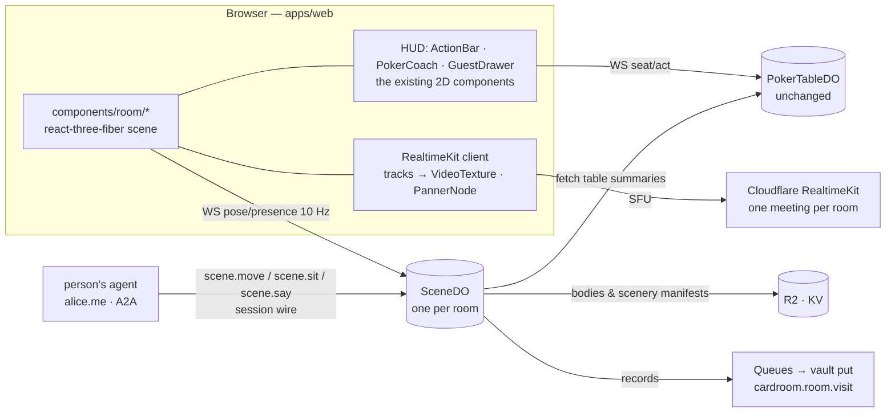

# The Room — a 3D card room with people in it

**Status:** specification, 2026-09-14; **phase 1 steps 1–2 built the same day** — `SceneDO` (migration v6),
`GET /rooms/:id` + `/rooms/:id/ws`, `lib/roomSocket.ts`, `components/room/Lounge.tsx` (built-in scenery, capsule
bodies, walking, the follow camera, zones), `pages/RoomPage.tsx` at `#/hall` and `#/clubs/<id>/room`. Proven
live: two people in the hall see each other, one walks to a table and both are told. The hold'em board that
exists (`components/Table.tsx`) stays exactly as it is; this is a **second way to sit at the same table**.

## 0. What this decides (read first)

1. **The Room is a third board, not a new game.** `apps/web` gets `components/room/` — a WebGL scene for
   `game: poker` — chosen by the person (`#/t/<id>?board=room`), never by the table. The engine, the
   `PokerTableDO`, the socket protocol, the seat, the buy-in, the coach: unchanged. "One board per game"
   becomes "one board per game per *presentation*"; a board still knows only its own game.
2. **A room is a place; a table is a thing in it.** `SceneDO` — one Durable Object per room (a club's
   lounge, the pickup hall) — holds who is standing where, at what, saying what, and nothing about cards.
   A table in the room IS a `PokerTableDO` the person already knows how to sit at; walking up to it and
   sitting down sends the same `seat` command the button does.
3. **Faces are video, placed.** The club's huddle is already Cloudflare RealtimeKit (`ClubHuddleProvider`,
   spec 378). The Room draws each participant's `MediaStreamTrack` as a texture where their avatar's face
   is, and pans their audio to where they stand. Kumospace put video in a shared plane; the Room puts it
   on a character at a table with scenery around it. Same SDK, one meeting per room.
4. **Every person is their agent.** The avatar is a facet of the person's Smart Agent (a vault record,
   `cardroom.avatar`, and a profile property), and the person's own A2A agent can **walk them, seat them,
   and speak for them** — `scene.move` / `scene.sit` / `scene.say` on the person's card, executed by the
   room under a session wire exactly the way the house names itself to an agent today. "Walk me to the
   table with the mission's guest" is one sentence at the Home.
5. **The house's bots are characters. The coach is a character. A mission's guest is a character.**
   Rules-based personas (`sharkbot.svc`, `melder.svc`) get bodies and a place to sit; the coach stands
   behind your chair and whispers (the advice you already get, placed); the mission's representative has
   a lectern by the fire, and walking up to them is the `GuestDrawer` you already have — in the room.
6. **Cloudflare carries it end to end.** Workers for the edge, Durable Objects with hibernatable
   WebSockets for presence, RealtimeKit for media, R2 for the scenery and bodies, KV for scene manifests,
   Queues for the record, Workers AI (optional) for made-to-measure avatars. No server anyone runs.
7. **Story-controlled interactions are a fourth phase, designed in from the first.** A `story` is a
   scene script the room executes — lights, a character's line, a door — driven by the same event bus
   as the table's hand. A mystery night is a story; a mission's introduction is a story.

## 1. The experience

You open a club's page and press **Enter the room**. The lounge loads — felt-green walls, a bar, a fire,
three or four tables under lamps — and you are standing in it as yourself: a body your Home knows, your
face on it live if your camera is on, your name above. Others are there: some seated, hands in play;
some standing at the bar talking (you hear them get louder as you walk over). A person from the mission
invited tonight is by the fire with a small plaque; walk up and their story is a panel beside them, and
they can talk to whoever comes.

Walk to a table. Its felt is real: the community cards, the pot, the dealer button, the chips, each
seat's stack, and the people at it — faces on the bodies, or a portrait ring where a camera is off. An
empty chair glows. Sit. The camera settles behind your cards. The ACTION BAR you already know appears at
the bottom (2D, exactly the one from the flat board — hotkeys and all); the coach's strip appears beside
it. Fold, and stand up, and walk to the bar.

Your agent can do all of that for you. "Sit me at Alice's table" at your Home, and the body walks over
and sits; "tell the table I'll be back in five" and it says so, in your name, over your seat.

## 2. Principles that bound the design

- **The table is the authority, the room is a view.** Seat state, chips, cards come from `PokerTableDO`
  over the same `TableSocket`; the room's `SceneDO` never learns a card. A desync between the two is a
  rendering bug, never a money bug.
- **A body is presence, not authority.** Standing next to a table grants nothing; the `seat` command
  and its buy-in gate decide, as now. An avatar that "sits" without the table saying so is drawn standing.
- **Attention is still a person's own input** (`ATTENTION_MS`, `anybodyAttending()`): walking counts,
  an agent moving you does not — a coach-driven body wandering a room is not a person at it.
- **Money never enters the scene layer.** No 3D chip you can drag; the bet slider is the HUD's.
- **A face is opt-in, per room, per session** — the huddle's mic/camera controls, unchanged.
- **Degrade to the flat board, always.** No WebGL, a phone, a slow link: the same URL without `?board=room`.

## 3. Architecture



### 3.1 Client — `apps/web/src/components/room/`

| Piece | Choice | Why |
| --- | --- | --- |
| Renderer | **three.js via `@react-three/fiber` + `@react-three/drei`**, lazy-loaded (the Leaflet pattern: never at module time) | React-native scene graph; the HUD stays React; one chunk (~600 KB gz) loaded only for `?board=room` |
| Bodies | **glTF, VRM-compatible humanoids**, 4–6 stock bodies + palette; a person's choice kept in their vault | VRM gives a standard skeleton, blend shapes for a face, and a large free ecosystem; no rigging of our own |
| Faces | The participant's `MediaStreamTrack` → `THREE.VideoTexture` on a face plane on the head (camera on), or a **portrait ring** with initials (camera off) | Kumospace's "video in the world", on a character |
| Audio | RealtimeKit audio track → `AudioContext` → `PannerNode` (HRTF) at the body's position; a table is a "quiet zone" (seated voices carry to the table, the bar fades) | Spatial voice is what makes a room a room |
| Movement | WASD / click-to-walk / touch joystick; third-person follow camera; seated camera behind the cards | Decentraland's walk, without a world |
| Cards & chips | The existing `CardDefs` SVG rasterised to a sprite atlas at load; chips as instanced cylinders | Same cards as the flat board; instancing keeps a 9-seat table under 200 draw calls |
| Scenery | A lounge as one glTF with named anchors (`table.1`, `bar`, `fire`, `lectern`, `door`), lit with baked lightmaps | Anchors are what a story script addresses |
| Text | Names, chat bubbles, the plaque: `drei` `<Html>` billboards | Real text, accessible, selectable |
| Interpolation | Client renders at display rate; poses arrive at ≤10 Hz and are eased | Bandwidth ~2 KB/s per person |

### 3.2 `SceneDO` — presence, one object per room

A Durable Object (SQLite, **hibernatable WebSockets**) per room id: `club:<clubId>` (the club's lounge)
or `hall` (the pickup hall). It holds:

- **who is in the room**: `{ agent, playerId, name, body, poseX,Y,Yaw, zone, seatedAt?: {tableId, seat}, at }`;
- **the room's manifest**: the scenery glTF (R2 key), anchors, which tables stand at which anchors
  (the club's open tables, read from `LobbyDO`, laid out on load and on table open/close);
- **the story state** (phase 4);
- and nothing about a hand.

Messages (WebSocket, JSON, the `TableSocket<M>` generic transport reused):

```
→ join   { token }                                    // the card-room session; a dev session cannot enter
→ pose   { x, y, yaw, t }                             // ≤10 Hz, dropped if older than the last
→ sit    { tableId, seat }                            // the ROOM asks the TABLE; the table's answer is what seats you
→ stand
→ say    { text }                                     // a bubble above your head, kept nowhere
→ look   { tableId } | { agent }                      // focus: which table's socket to subscribe (the HUD opens)
← room   { manifest, people[], tables[] }             // on join
← people { upserts[], leaves[] }                      // deltas, batched per 100 ms
← zone   { tableId | 'bar' | 'fire' | null }          // when your zone changes (audio and HUD follow it)
← story  { cue }                                      // phase 4
```

Hibernation keeps an idle room at zero cost; a room wakes on the first socket. Presence rows live
in SQLite so a reconnect restores the room; nothing outlives the session.

### 3.3 Video — one RealtimeKit meeting per room

The huddle today is a meeting per **club** (`POST /clubs/:id/huddle/:op` → the Home's huddle service).
The Room reuses that meeting for a club's lounge — a member walking in joins the huddle they could
already join from the club's page — and adds a `hall` meeting for the pickup hall (a `club`-less scope
the Home's huddle service gains, gated by any card-room session).

- Every participant publishes one video and one audio track, as now.
- The room **subscribes selectively**: video for people within 8 m or at your table, audio for everyone
  in earshot, at a gain from distance. Above ~25 people the room asks the SDK for lower-resolution
  layers for the far ones (simulcast) — the SFU does the work, the browser decodes what it draws.
- Tokens, custody, standing: unchanged — the card room names the member to the Home under the paired
  secret, the `authToken` passes through once.

### 3.4 The table in the room

Walking into a table's zone subscribes the HUD to that table's `TableSocket` as a spectator (the flat
board's own transport); the felt draws from `view` and `events` exactly as `Table.tsx` does, in 3D
(cards as sprites, chips as instances, the pot in the middle, the dealer button). **Sitting** sends the
flat board's `seat` command with the same buy-in gate. The person is then drawn in the chair the TABLE
says, not the chair they walked to. Every table-side rule — pace, attention, pause, the coach's modes,
"a coach playing for somebody is not somebody" — is untouched because the table is untouched.

### 3.5 Agents in the scene — the Agentic Primitives layer

| Concern | Primitive | How the Room uses it |
| --- | --- | --- |
| Who you are | Smart Agent, typed name (`alice.me`) | The body's name plate; the seat's identity; the huddle's identity — one address, three facets |
| Your body | vault record `cardroom.avatar` (`apctx:CardRoomAvatar`, `cr:Avatar`) + agent-profile property `atl:avatar` (a content hash) | Chosen once at the Home or in the room; read by the room under the person's own session; the profile property lets any room (another card room, a Field team) draw the same body |
| Walking, sitting, speaking for you | A2A skills on the person's card: `scene.move {x,y} \| {anchor}`, `scene.sit {table}`, `scene.stand`, `scene.say {text}`; the ROOM executes them | The person's agent (at the Home, `playbook.answer` / `harness.ask`) sends `message/send` to the room's card with a **session wire** the person signed once (delegator = the person, delegate = the room's key, selector `scene.act`, a day); the room verifies it as the house verifies every wire today (`verifySessionWrappedSignature`) and moves the body. Revocable on chain; no wire, no walking |
| Being spoken to | `scene.hail {from}` on the person's card | Somebody walks up and says your name: the room delivers it to your agent, which decides — a bubble, a summons at your Home, or silence, by your standing instructions |
| The house's bots | the personas' cards gain `scene.act` beside `poker.act`; the house's session wire | A persona is drawn at its seat; between hands it stretches; it never walks (a persona's body is decoration for a seat, not presence) |
| The coach | the coach service, unchanged; the ROOM places its words | Bob's line is drawn as a whisper bubble behind your chair, from the same `Advice` the strip shows; no new call |
| The mission's guest | `cr:MissionVisit` on the night; the representative's own agent when they have one | A lectern anchor; the plaque is the `MissionListing`; the person is drawn there when their agent is in the room, a portrait ring when not; walking up opens the `GuestDrawer` |
| Consent & scope | delegation caveats (timestamp, `AllowedMethods` = `scene.act`), `harness.ask` for asks | Moving a body is the whole authority; nothing in `scene.*` can seat with money — `seat` still comes from the person's own socket |
| Record | vault put `cardroom.room.visit` (who you sat with, when, which night) — counts, never a transcript | Through Queues from `SceneDO` to the person's agent, like `poker.record`; opt-in, and the coach never sees it |
| Ontology | `cr:Room` (⊑ at:Place), `cr:Avatar` (⊑ prov:Entity, facet of at:Person), `cr:Presence` (⊑ at:Participation: `cr:standsAt` anchor/table, `cr:seatedAt`), `cr:SceneCue` (⊑ at:Event) | The scene's vocabulary is the card room's, published beside clubs and missions |

### 3.6 Cloudflare — the whole estate for it

| Need | Service | Note |
| --- | --- | --- |
| Presence, rooms, story | Durable Objects (SQLite, hibernatable WebSockets) | `SceneDO`; migration `v6` |
| Media | RealtimeKit (SFU; simulcast; selective subscription; recording off) | One meeting per room; the Home's huddle service issues tokens as today |
| Scenery, bodies, atlases | R2 behind a cached Worker route (`assets.gamenight…`), immutable keys by content hash | 20–60 MB per lounge; served with long cache, ranged |
| Manifests, layouts | KV | `room:<id>` manifest, anchors, the tables' placement |
| Records | Queues → the tables Worker → `poker.record`-style vault puts | Never blocks a frame |
| Made-to-measure bodies (optional) | Workers AI (image models for a portrait ring style; not for the body mesh) | A stylised portrait from the person's own camera frame, kept in their vault only |
| Edge, auth, rate limits | Workers, the existing session, `RL_SESSION` | `SceneDO` sockets are rate-limited like `/ws` |
| Protection | Turnstile on `join` for the pickup hall | A club's lounge is gated by standing already |

**Cost, roughly, at 30 people in a room for two hours:** RealtimeKit ~30 × 120 min of participant-minutes;
DO wall-time negligible under hibernation (billed on requests + duration while awake, and a room is awake
only while sockets are open); R2 egress ~1 GB/day of scenery at 100 first-visits (cached at the edge after
the first). Bandwidth per browser: ~1.5 Mb/s down at 6 visible faces (simulcast low layers), ~0.3 Mb/s up.

## 4. Protocol additions (`packages/protocol`)

```ts
// The room, on the wire — the ENVELOPE is the room's; a table's payload stays the game's.
export interface RoomPerson { agent: string; playerId: string; name: string; body: string; x: number; y: number; yaw: number; zone: string | null; seatedAt?: { tableId: string; seat: number } }
export interface RoomManifest { roomId: string; scene: string /* R2 key */; anchors: Record<string, { x: number; y: number; yaw: number }>; tables: Array<{ tableId: string; anchor: string }> }
export type RoomClientMessage = { type: 'join'; token: string } | { type: 'pose'; x: number; y: number; yaw: number; t: number } | { type: 'sit'; tableId: string; seat: number } | { type: 'stand' } | { type: 'say'; text: string } | { type: 'look'; tableId?: string; agent?: string };
export type RoomServerMessage = { type: 'room'; manifest: RoomManifest; people: RoomPerson[] } | { type: 'people'; upserts: RoomPerson[]; leaves: string[] } | { type: 'zone'; zone: string | null } | { type: 'story'; cue: SceneCue };

// A2A, on the person's card (CARD_ROOM_SKILLS gains a `scene` family):
//   scene.move  { x, y } | { anchor: string } | { toward: { agent } }
//   scene.sit   { tableId, seat? }      → the room forwards to the table under the PERSON's own socket-less path: refused unless the person is in the room
//   scene.stand
//   scene.say   { text }                 ≤ 140 chars, drawn as a bubble, kept nowhere
//   scene.hail  { from: string; text? }  inbound: somebody at your body
```

`TableSummary` gains nothing. `CreateTableRequest` gains `anchor?` for a club's lounge (which lamp).

## 5. Rendering plan, in order

1. **Lounge shell**: scene glTF from R2, anchors, a body walking, follow camera, name plates. 60 fps on a
   2020 laptop, 30 on a 2022 phone (WebGL2; WebGPU when `navigator.gpu` says so).
2. **Presence**: `SceneDO` sockets; ten bodies; interpolation; zones.
3. **Voice, placed**: the room's meeting; panners; the bar louder than the fire.
4. **Faces**: `VideoTexture` on heads within 8 m; portrait rings beyond and for cameras off.
5. **The table**: felt from `view`; sprites for cards; the HUD's ActionBar over it; `seat` from the chair.
6. **Characters**: personas' bodies; the coach's whisper; the lectern and the `GuestDrawer`.
7. **Agents move bodies**: `scene.*` on the card, the wire, the Home's "walk me over".
8. **Story cues**: `SceneCue { lights, line: { anchor, text }, door, camera }` from a script the host writes
   for a night (a mission's introduction; a mystery's first clue).

## 6. Phases

| Phase | Ships | Proof |
| --- | --- | --- |
| **P1 — the lounge** (3–4 weeks) | 1–4 above; `?board=room`; a club's lounge only | Two people walk to each other and hear the other's voice pan; a third sees both |
| **P2 — the seated scene** (3 weeks) | 5; the flat HUD over the 3D felt; the pickup hall | A full hand played by three people in the room and one on the flat board, byte-identical at the table |
| **P3 — characters** (3 weeks) | 6–7; `scene.*` skills, wires, ontology; personas, coach, lectern | "Walk me to the guest" at the Home moves the body; a persona is drawn at its seat |
| **P4 — scenery & story** (open) | 8; a second lounge; the mystery night | A host's script runs a cue when the river card lands |

## 7. Open questions

- ~~RealtimeKit per-participant subscription control~~ — **answered 2026-09-14**: `@cloudflare/realtimekit`
  0.1.0 exposes `meeting.participants.setViewMode('MANUAL')` and `subscribe(peerIds, kinds)` /
  `unsubscribe(peerIds, kinds)` per participant and per kind (`audio` | `video` | screenshare), plus
  `setMaxActiveParticipantsCount`. The room subscribes by distance and by table with those. Simulcast layer
  selection is not surfaced as an API; the preset's `maxVideoStreams` and the SFU's own layer choice bound it.
- **VRM licensing** for stock bodies (CC-BY assets exist; commission four).
- **Phones**: P1 ships desktop-first; the phone gets the flat board until a joystick and a 30 fps budget
  are proven.
- **`scene.sit` and money**: the room forwards a sit to the table on the person's behalf only for a
  play-money table in P3; a money table's seat stays a button the person presses.
- **Recording**: never. The room keeps counts (who, when, at which night), not audio.

## 8. Acceptance

- A person with no WebGL gets the flat board at the same URL, told why.
- Closing the tab stands the body up within 5 s; the seat follows the table's own idle rules, unchanged.
- A body cannot be at a table its person is not seated at (the table's `welcome`/`seat` events are the source).
- `scene.move` from an agent without a live wire is refused with the reason, and nothing moves.
- Replaying a hand from `(seed, action log)` is byte-identical whether the hand was played in the room or on the flat board.
